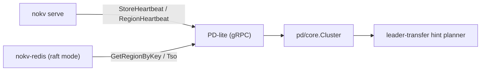

# PD-lite

`PD-lite` is NoKV's control-plane service for distributed mode.  
It exposes a gRPC API (`pb.PD`) and is started by:

```bash
go run ./cmd/nokv pd --addr 127.0.0.1:2379
```

---

## 1. Responsibilities

PD-lite currently owns:

- **Routing**: `GetRegionByKey`
- **Heartbeats**: `StoreHeartbeat`, `RegionHeartbeat`
- **Region removal**: `RemoveRegion`
- **ID service**: `AllocID`
- **TSO**: `Tso`

Runtime clients (for example `cmd/nokv-redis` raft backend) use PD as the
routing source of truth, but PD is not the durable owner of cluster topology
truth. Durable truth lives in `meta/root`.

---

## 2. Runtime Architecture


```mermaid
flowchart LR
    Store["nokv serve"] -->|"StoreHeartbeat / RegionHeartbeat"| PD["PD-lite (gRPC)"]
    Gateway["nokv-redis (raft mode)"] -->|"GetRegionByKey / Tso"| PD
    PD --> Cluster["pd/core.Cluster"]
    Cluster --> Scheduler["leader-transfer hint planner"]
```

Core implementation units:

- `pd/core`: in-memory cluster metadata model + allocators.
- `pd/storage`: persistence abstraction (`Store`) backed by the metadata root.
- `pd/server`: gRPC service + RPC validation/error mapping.
- `pd/client`: client wrapper used by store/gateway.
- `pd/adapter`: scheduler sink that forwards heartbeats into PD.

---

## 3. Mode Model

NoKV currently has only two supported product modes:

### `standalone`

- no `pd`
- no `meta/root`
- no control-plane process
- all truth remains inside the single storage process

This is the default local engine shape. Standalone is not a degraded control
plane deployment; it simply has no control plane.

### `distributed`

`distributed` has two formal control-plane deployments:

1. `single pd + local meta`
2. `3 pd + replicated meta`

Both deployments keep the same logical split:

- `meta/root/*`: durable rooted truth
- `pd/view` + `pd/core`: rebuildable routing/scheduling state
- `pd/server`: gRPC API surface

The difference is only the rooted backend:

- `single pd + local meta`
  - one `pd` process
  - one same-process `meta/root/backend/local`
  - single-node durable truth
- `3 pd + replicated meta`
  - three `pd` processes
  - each process hosts one same-process `meta/root/backend/replicated`
  - fixed three-replica rooted truth
  - one rooted leader accepts truth writes, followers refresh rooted state and serve read/view traffic

No other product control-plane mode is supported. In particular:

- there is no separate `meta` cluster
- there is no `pd` cluster larger than three members
- there is no dynamic metadata membership today

---

## 4. Persistence (`--workdir`)

`--workdir` is required for every formal PD deployment that hosts rooted truth.

### `single pd + local meta`

The rooted backend stores:

- `root.events.wal`
- `root.checkpoint.binpb`

### `3 pd + replicated meta`

Each PD node has its own workdir and persists two layers of state:

1. rooted truth state
   - `root.events.wal`
   - `root.checkpoint.binpb`
2. replicated protocol state
   - `root.raft.bin`
   - contains raft hard state, raft snapshot, and retained raft entries

Each node must have an isolated workdir. Workdirs are not shared.

### Rooted bootstrap flow

The PD storage layer rebuilds its region snapshot and allocator checkpoints by
replaying rooted truth:

- **region descriptor publish/tombstone** events rebuild the route catalog
- **allocator fences** rebuild:
  - `id_current`
  - `ts_current`

Startup flow:

1. Open rooted `pd/storage` from `--workdir`.
2. Reconstruct a rooted PD snapshot (`regions` + allocator fences).
3. Compute starts as `max(cli_start, fence+1)`.
4. Materialize the rooted region snapshot into `pd/core.Cluster`.

For replicated mode, followers periodically refresh rooted state and rebuild the
service-side view. This avoids allocator rollback and removes the old parallel
`PD_STATE.json` truth table.

### Region Truth Hierarchy

NoKV intentionally keeps three region views with different authority:

- **PD region catalog**: cluster routing truth. Clients and stores must treat
  PD as the authoritative key-to-region source at the service boundary, but
  PD rebuilds this view from rooted metadata truth plus heartbeats.
- **`raftstore/localmeta` local catalog**: store-local recovery truth. It exists so
  one store can restart hosted peers and replay raft WAL checkpoints even if
  PD is temporarily unavailable.
- **`Store.regions` runtime catalog**: in-memory cache/view rebuilt from local
  metadata at startup and then advanced by peer lifecycle plus raft apply.

These layers are not interchangeable. Local metadata is recovery state, not
cluster routing authority.

---

## 5. Config Integration

`raft_config.json` supports PD endpoint + workdir defaults:

```json
"pd": {
  "addr": "127.0.0.1:2379",
  "docker_addr": "nokv-pd:2379",
  "work_dir": "./artifacts/cluster/pd",
  "docker_work_dir": "/var/lib/nokv-pd"
}
```

Resolution rules:

- CLI override wins.
- Otherwise read from config by scope (`host` / `docker`).

Helpers:

- `config.ResolvePDAddr(scope)`
- `config.ResolvePDWorkDir(scope)`
- `nokv-config pd --field addr|workdir --scope host|docker`

Replicated-root transport settings are currently CLI-driven, not config-file
driven.

---

## 6. Routing Source Convergence

NoKV now uses **PD-first routing**:

- `raftstore/client` resolves regions with `GetRegionByKey`.
- `raft_config` regions are bootstrap/deployment metadata.
- Runtime route truth comes from PD heartbeats + PD region catalog.

This avoids dual sources drifting over time (config vs PD).

---

## 7. Serve Mode Semantics

`nokv serve` is now PD-only:

- `--pd-addr` is required.
- Runtime routing/scheduling control-plane state is sourced from PD.

Related CLI behavior:

- Inspect control-plane state through PD APIs/metrics.
- `nokv pd --metrics-addr <host:port>` exposes native expvar on `/debug/vars`.
- `nokv serve --metrics-addr <host:port>` exposes store/runtime expvar on `/debug/vars`.

---

## 8. Service Semantics

`PD-lite` intentionally separates rooted truth leadership from the outer gRPC
service surface.

In `3 pd + replicated meta`:

- all three `pd` processes may listen and serve RPC
- only the rooted leader may commit truth writes
- followers refresh rooted state and serve read/view traffic

### Leader-only writes

These RPCs require rooted leadership:

- `RegionHeartbeat`
- `PublishRootEvent`
- `RemoveRegion`
- `AllocID`
- `Tso`

Followers return `FailedPrecondition` with `pd not leader` semantics, and
clients are expected to retry against another PD endpoint.

### Any-node reads

These RPCs may be served by any PD node:

- `GetRegionByKey`
- `StoreHeartbeat` handling and store-view inspection

Follower reads are driven by rooted refresh into `pd/core.Cluster`. They are
expected to be shortly stale rather than linearly consistent.

### Client behavior

`pd/client` accepts multiple PD addresses. Write RPCs retry across PD nodes and
converge on the rooted leader. Read RPCs may use any available PD endpoint.

---

## 9. Deployment Examples

### `single pd + local meta`

```bash
go run ./cmd/nokv pd \
  -addr 127.0.0.1:2379 \
  -workdir ./artifacts/pd
```

### `3 pd + replicated meta`

Node 1:

```bash
go run ./cmd/nokv pd \
  -addr 127.0.0.1:2379 \
  -workdir ./artifacts/pd1 \
  -root-mode replicated \
  -root-node-id 1 \
  -root-transport-addr 127.0.0.1:2471 \
  -root-peer 1=127.0.0.1:2471 \
  -root-peer 2=127.0.0.1:2472 \
  -root-peer 3=127.0.0.1:2473
```

Node 2 and node 3 use the same peer map, but change:

- `-addr`
- `-workdir`
- `-root-node-id`
- `-root-transport-addr`

Current product assumptions:

- exactly three rooted replicas
- one workdir per PD node
- one transport address per PD node
- no dynamic membership

---

## 10. Comparison: TinyKV / TiKV

### TinyKV (teaching stack)

- Uses a scheduler server (`tinyscheduler`) as separate process.
- Control plane integrates embedded etcd for metadata persistence.
- Educational architecture, minimal production hardening.

### TiKV (production stack)

- PD is an independent, highly available cluster.
- PD internally uses etcd Raft for durable metadata + leader election.
- Rich scheduling and balancing policies, rolling updates, robust ops tooling.

### NoKV PD-lite (current)

- Standalone mode has no PD and no metadata-root service.
- Distributed mode runs one control-plane process:
  - `pd`
  - one local `meta/root`
- Current project scope intentionally keeps the metadata root single-node. This
  bounds operational and maintenance complexity while still keeping truth and
  view logically separated.
- PD persistence is intentionally limited to rooted control-plane truth:
  - region descriptor publish/tombstone events
  - allocator durability (`AllocID`, `TSO`)
- PD is not the durable owner of a store's local raft/region truth. Store
  restart truth remains in `raftstore/localmeta`, while PD keeps routing and
  scheduling state rebuilt from `meta/root`.

---

## 11. Current Limitations / Next Steps

- `single pd + local meta` remains the simpler and more mature deployment.
- `3 pd + replicated meta` is now a formal product mode, but still has a
  simpler follower sync path based on rooted refresh rather than push/watch.
- Scheduler policy is intentionally small (leader transfer focused).
- No advanced placement constraints yet.
- Metadata membership is fixed at three replicas.

These are deliberate scope limits for a fast-moving experimental platform that
keeps the rooted truth surface small.
