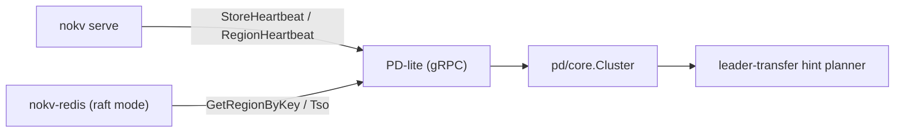

# PD-lite

`PD-lite` is NoKV's control-plane service for distributed mode.  
It exposes a gRPC API (`pb.PD`) and is started by:

```bash
go run ./cmd/nokv pd --addr 127.0.0.1:2379
```

For a single-node distributed control plane, PD can now host an embedded
metadata-root raft node in the same process:

```bash
go run ./cmd/nokv pd --addr 127.0.0.1:2379 --workdir ./artifacts/pd --meta-backend raft-single
```

---

## 1. Responsibilities

PD-lite currently owns:

- **Routing**: `GetRegionByKey`
- **Heartbeats**: `StoreHeartbeat`, `RegionHeartbeat`
- **Region removal**: `RemoveRegion`
- **ID service**: `AllocID`
- **TSO**: `Tso`

Runtime clients (for example `cmd/nokv-redis` raft backend) use PD as the
routing source of truth, but PD is not the durable owner of cluster topology
truth. Durable truth lives in `meta/root`.

---

## 2. Runtime Architecture


```mermaid
flowchart LR
    Store["nokv serve"] -->|"StoreHeartbeat / RegionHeartbeat"| PD["PD-lite (gRPC)"]
    Gateway["nokv-redis (raft mode)"] -->|"GetRegionByKey / Tso"| PD
    PD --> Cluster["pd/core.Cluster"]
    Cluster --> Scheduler["leader-transfer hint planner"]
```

Core implementation units:

- `pd/core`: in-memory cluster metadata model + allocators.
- `pd/storage`: persistence abstraction (`Store`) backed by the metadata root.
- `pd/server`: gRPC service + RPC validation/error mapping.
- `pd/client`: client wrapper used by store/gateway.
- `pd/adapter`: scheduler sink that forwards heartbeats into PD.

---

## 3. Persistence (`--workdir`)

When `--workdir` is provided, PD-lite opens one metadata-root backend.

Supported backends:

- `--meta-backend local`
  - file-backed rooted state
  - intended for reference/testing and the current non-raft compatibility path
- `--meta-backend raft-single`
  - single-node embedded metadata-root raft
  - intended for distributed-dev mode

`raft-single` persists:

- `meta-root-raft/root-raft-wal`
- `meta-root-raft/root-raft-hardstate.pb`
- `meta-root-raft/root-raft-snapshot.pb`
- `meta-root-raft/root-raft-checkpoint.pb`

`local` persists:

- `metadata-root.log`
- `metadata-root-checkpoint.pb`

The PD storage layer rebuilds its region snapshot and allocator checkpoints by
replaying root events:

- **Region descriptor publish/tombstone** events rebuild the route catalog.
- **Allocator fences** rebuild:
  - `id_current`
  - `ts_current`

Startup flow:

1. Open rooted `pd/storage` with `--workdir`.
2. Replay the metadata root into a PD snapshot (`regions` + allocator fences).
3. Compute starts as `max(cli_start, fence+1)`.
4. Replay the rooted region snapshot into `pd/core.Cluster`.

This avoids allocator rollback and removes the old parallel `PD_STATE.json`
truth table.

### Region Truth Hierarchy

NoKV intentionally keeps three region views with different authority:

- **PD region catalog**: cluster routing truth. Clients and stores must treat
  PD as the authoritative key-to-region source at the service boundary, but
  PD rebuilds this view from rooted metadata truth plus heartbeats.
- **`raftstore/localmeta` local catalog**: store-local recovery truth. It exists so
  one store can restart hosted peers and replay raft WAL checkpoints even if
  PD is temporarily unavailable.
- **`Store.regions` runtime catalog**: in-memory cache/view rebuilt from local
  metadata at startup and then advanced by peer lifecycle plus raft apply.

These layers are not interchangeable. Local metadata is recovery state, not
cluster routing authority.

---

## 4. Config Integration

`raft_config.json` supports PD endpoint + workdir defaults:

```json
"pd": {
  "addr": "127.0.0.1:2379",
  "docker_addr": "nokv-pd:2379",
  "work_dir": "./artifacts/cluster/pd",
  "docker_work_dir": "/var/lib/nokv-pd"
}
```

Resolution rules:

- CLI override wins.
- Otherwise read from config by scope (`host` / `docker`).

Helpers:

- `config.ResolvePDAddr(scope)`
- `config.ResolvePDWorkDir(scope)`
- `nokv-config pd --field addr|workdir --scope host|docker`

---

## 5. Routing Source Convergence

NoKV now uses **PD-first routing**:

- `raftstore/client` resolves regions with `GetRegionByKey`.
- `raft_config` regions are bootstrap/deployment metadata.
- Runtime route truth comes from PD heartbeats + PD region catalog.

This avoids dual sources drifting over time (config vs PD).

---

## 6. Serve Mode Semantics

`nokv serve` is now PD-only:

- `--pd-addr` is required.
- Runtime routing/scheduling control-plane state is sourced from PD.

Related CLI behavior:

- Inspect control-plane state through PD APIs/metrics.
- `nokv pd --metrics-addr <host:port>` exposes native expvar on `/debug/vars`.
- `nokv serve --metrics-addr <host:port>` exposes store/runtime expvar on `/debug/vars`.

---

## 7. Comparison: TinyKV / TiKV

### TinyKV (teaching stack)

- Uses a scheduler server (`tinyscheduler`) as separate process.
- Control plane integrates embedded etcd for metadata persistence.
- Educational architecture, minimal production hardening.

### TiKV (production stack)

- PD is an independent, highly available cluster.
- PD internally uses etcd Raft for durable metadata + leader election.
- Rich scheduling and balancing policies, rolling updates, robust ops tooling.

### NoKV PD-lite (current)

- Standalone mode has no PD and no metadata-root service.
- Distributed-dev mode can run one control-plane process:
  - `pd`
  - embedded `meta/root/raft` (`--meta-backend raft-single`)
- Distributed HA mode is intended to run three control-plane processes, each
  hosting:
  - `pd`
  - one `meta/root/raft` node
- This keeps truth and view logically separate without forcing two independent
  control-plane clusters.
- PD persistence is intentionally limited to rooted control-plane truth:
  - region descriptor publish/tombstone events
  - allocator durability (`AllocID`, `TSO`)
- PD is not the durable owner of a store's local raft/region truth. Store
  restart truth remains in `raftstore/localmeta`, while PD keeps routing and
  scheduling state rebuilt from `meta/root`.

---

## 8. Current Limitations / Next Steps

- `--meta-backend raft-single` is embedded single-node only. Multi-node
  control-plane bootstrapping is the next step.
- Scheduler policy is intentionally small (leader transfer focused).
- No advanced placement constraints yet.

These are deliberate scope limits for a fast-moving experimental platform.
