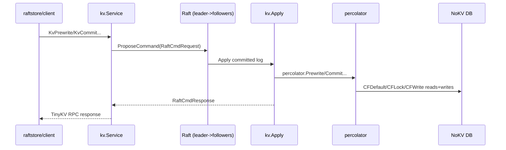
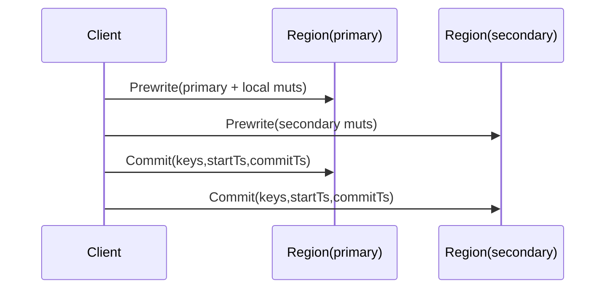

# Percolator Distributed Transaction Design

This document explains NoKV's distributed transaction path implemented by `percolator/` and executed through `raftstore`.

The scope here is the current code path:

- `Prewrite`
- `Commit`
- `BatchRollback`
- `ResolveLock`
- `CheckTxnStatus`
- MVCC read visibility (`KvGet`/`KvScan` through `percolator.Reader`)

It does not describe the removed standalone transaction API.

---

## 1. Where It Runs

Percolator logic is executed on the Raft apply path:

1. Client sends TinyKV RPC (`KvPrewrite`, `KvCommit`, ...).
2. `raftstore/kv/service.go` wraps it into a `RaftCmdRequest`.
3. Store proposes command through Raft.
4. On apply, `raftstore/kv/apply.go` dispatches to `percolator.*`.

Key files:

- [`percolator/txn.go`](../percolator/txn.go)
- [`percolator/reader.go`](../percolator/reader.go)
- [`percolator/codec.go`](../percolator/codec.go)
- [`percolator/latch/latch.go`](../percolator/latch/latch.go)
- [`raftstore/kv/apply.go`](../raftstore/kv/apply.go)
- [`raftstore/client/client.go`](../raftstore/client/client.go)

---

## 2. MVCC Data Model

NoKV uses three MVCC column families:

- `CFDefault`: stores user values at `start_ts`
- `CFLock`: stores lock metadata at fixed `lockColumnTs = MaxUint64`
- `CFWrite`: stores commit records at `commit_ts`

### 2.1 Lock Record

`percolator.Lock` (encoded by `EncodeLock`):

- `Primary`
- `Ts` (start timestamp)
- `TTL`
- `Kind` (`Put/Delete/Lock`)
- `MinCommitTs`

### 2.2 Write Record

`percolator.Write` (encoded by `EncodeWrite`):

- `Kind`
- `StartTs`
- `ShortValue` (codec supports it; current commit path does not populate it)

---

## 3. Concurrency Control: Latches

Before mutating keys, percolator acquires striped latches:

- `latch.Manager` hashes keys to stripe mutexes.
- Stripes are deduplicated and acquired in sorted order to avoid deadlocks.
- Guard releases in reverse order.

In `kv/apply.go`, one process-wide manager is used:

- `defaultLatches = latch.NewManager(512)`

This serializes conflicting apply operations on overlapping keys in one node.

---

## 4. Two-Phase Commit Flow

Client side (`raftstore/client.Client.TwoPhaseCommit`):

1. Group mutations by region.
2. Prewrite primary region.
3. Prewrite secondary regions.
4. Commit primary region.
5. Commit secondary regions.

---

## 5. Write-Side Operations

## 5.1 Prewrite

`Prewrite` runs mutation-by-mutation:

1. Check existing lock on key:
   - if lock exists with different `Ts` -> `KeyError.Locked`
2. Check latest committed write:
   - if `commit_ts >= req.start_version` -> `WriteConflict`
3. Apply data intent:
   - `Put`: write value into `CFDefault` at `start_ts`
   - `Delete`/`Lock`: delete default value at `start_ts` (if exists)
4. Write lock into `CFLock` at `lockColumnTs`

### 5.2 Commit

For each key:

1. Read lock
2. If no lock:
   - if write with same `start_ts` exists -> idempotent success
   - else -> abort (`lock not found`)
3. If lock `Ts != start_version` -> `KeyError.Locked`
4. `commitKey`:
   - if `min_commit_ts > commit_version` -> `CommitTsExpired`
   - if write with same `start_ts` already exists:
     - rollback write -> abort
     - write with different commit ts -> treat success, clean lock
     - same commit ts -> success
   - else write `CFWrite[key@commit_ts] = {kind,start_ts}`
   - remove lock from `CFLock`

### 5.3 BatchRollback

For each key:

1. If already has write at `start_ts`:
   - rollback marker already exists -> success
   - non-rollback write exists -> success (already committed)
2. Remove lock (if any)
3. Remove default value at `start_ts` (if any)
4. Write rollback marker to `CFWrite` at `start_ts`

### 5.4 ResolveLock

- `commit_version == 0` -> rollback matching locks
- `commit_version > 0` -> commit matching locks
- Returns number of resolved keys

---

## 6. Transaction Status Check

`CheckTxnStatus` targets the primary key and decides whether txn is alive, committed, or should be rolled back.

Decision order:

1. Read lock on primary
2. If lock exists but `lock.ts != req.lock_ts` -> `KeyError.Locked`
3. If lock exists and TTL expired (`current_ts >= lock.ts + ttl`):
   - rollback primary
   - action = `TTLExpireRollback`
4. If lock exists and caller pushes timestamp:
   - `min_commit_ts = max(min_commit_ts, caller_start_ts+1)`
   - action = `MinCommitTsPushed`
5. If no lock, check write by `start_ts`:
   - committed write -> return `commit_version`
   - rollback write -> action `LockNotExistRollback`
6. If no lock and no write, and `rollback_if_not_exist` is true:
   - write rollback marker
   - action `LockNotExistRollback`

---

## 7. Read Path Semantics (MVCC Visibility)

`KvGet` and `KvScan` read through `percolator.Reader`:

1. Check lock first:
   - if lock exists and `read_ts >= lock.ts`, return locked error
2. Find visible write in `CFWrite`:
   - latest `commit_ts <= read_ts`
3. Interpret write kind:
   - `Delete`/`Rollback` => not found
   - `Put` => read value from `CFDefault` at `start_ts`

Notes:

- `KvScan` currently rejects reverse scan.
- `scanWrites` uses internal iterator over `CFWrite`.

---

## 8. Error and Idempotency Behavior

| Operation | Idempotency/Conflict behavior |
| --- | --- |
| Prewrite | Rejects lock conflicts and write conflicts; returns per-key `KeyError` list. |
| Commit | Idempotent for already committed keys with same `start_ts`; stale/missing lock may abort. |
| BatchRollback | Safe to repeat; rollback marker prevents duplicate side effects. |
| ResolveLock | Safe to retry per key set; resolves only matching `start_ts` locks. |
| CheckTxnStatus | May push `min_commit_ts`, rollback expired primary lock, or return committed version. |

---

## 9. Current Constraints

- This path is distributed-only and tied to TinyKV RPC + Raft apply.
- Standalone/local transaction APIs are intentionally removed.
- Latch scope is per-node process (`defaultLatches`), with region-level correctness coming from Raft sequencing.
- `Write.ShortValue` is encoded/decoded but not used by current commit writer.

---

## 10. Validation and Tests

Primary coverage:

- [`percolator/txn_test.go`](../percolator/txn_test.go)
- [`raftstore/kv/service_test.go`](../raftstore/kv/service_test.go)
- [`raftstore/client/client_test.go`](../raftstore/client/client_test.go)
- [`raftstore/server/server_test.go`](../raftstore/server/server_test.go)

These tests cover 2PC happy path, lock conflicts, status checks, resolve/rollback behavior, and client region-aware retries.
