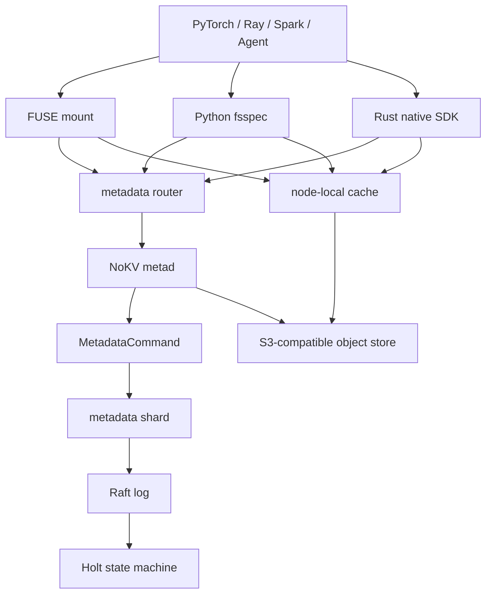

<!--
Copyright 2024-2026 The NoKV Authors.
SPDX-License-Identifier: Apache-2.0
-->

# Product Design

NoKV is a Rust filesystem for AI training and agent workspaces. It presents a
file interface, keeps namespace metadata in Holt, and stores file bodies in
external object storage.

The product is not a generic distributed KV database, a full NAS replacement,
or a raw S3 mount. It owns filesystem metadata semantics and delegates byte
durability to local or S3-compatible object storage.

## Product Boundary

```text
NoKV
  owns:
    namespace truth
    inode/dentry metadata
    metadata command atomicity
    body descriptors
    checkpoint/artifact publish points
    watch/snapshot/cache invalidation metadata

  delegates:
    file body durability
    object replication
    object lifecycle storage
```

This keeps the system focused. Object stores already provide elastic byte
storage. NoKV adds the metadata layer that object stores do not provide:
fast directory state, atomic path publication, typed workspace events, and
mountable namespace views.

## HOLT Role

Holt is the metadata storage engine. It is not the whole metadata service.

```text
NoKV metad
  inode/dentry semantics
  MetadataCommand validation
  watch/snapshot/GC policy
  publish and remove semantics
  service and client APIs

Holt
  local ordered metadata engine
  ART prefix/range lookup
  atomic batch
  WAL/checkpoint/recovery
```

This separation matters because the filesystem semantics must remain above the
storage engine. The `nokvfs-meta` crate may bind those semantics to Holt. The
types, object, client, and FUSE crates must not leak Holt internals.

## Reference Shape

NoKV borrows the proven split used by object-backed filesystems: metadata is
separate from bytes, and clients can access the namespace through FUSE or a
native SDK.

```text
AI training / agent process
  -> FUSE, Rust SDK, or Python/fsspec
  -> NoKV metadata service
  -> Holt metadata engine
  -> S3-compatible object store
```

FUSE is the compatibility path. Native clients are the performance path for
data loaders, checkpoint writers, Ray jobs, and agent runtimes that can call a
library directly.

## Target Architecture



The first implementation is a single-node `metad` server backed by Holt. The
distributed target is metadata-shard replication with Holt as each shard's
local state machine.

## Kubernetes Deployment Target

The cloud-native deployment should grow into these components:

```text
nokvfs-server
  long-running metadata service, health/control plane, and future router

nokvfs-csi
  Kubernetes volume lifecycle and node mount integration

nokvfs-cache-agent
  node-local metadata/object cache for GPU and training nodes

nokvfs-gc-controller
  staged object cleanup, checkpoint retention, and orphan body GC

nokvfs-python
  Python SDK and fsspec binding for training frameworks
```

The current repository implements a long-running single-node `nokvfs-server`,
framed metadata RPC for the Rust SDK and CLI, and the FUSE frontend. FUSE over
the metadata server, CSI, Python, node-local cache, and distributed metadata
shards remain product direction.

## Metadata Distribution

The first distributed version should use one metadata shard per mount. A shard
is a Raft group whose state machine is a Holt instance.

```text
client
  -> metadata router
  -> shard leader
  -> Raft commit
  -> Holt atomic batch apply
  -> watch/cache invalidation event
  -> response
```

Later versions may split one mount into subtree or workload shards:

```text
dataset namespace shard
checkpoint namespace shard
large directory shard
workspace/channel shard
```

Cross-shard rename and cross-mount atomic transactions are not part of the
first distributed target. Same-shard rename remains atomic. Cross-shard rename
can return `EXDEV` until a handoff or transaction protocol exists.

## Metadata Model

The canonical namespace model is inode/dentry, not full path as the source of
truth.

```text
inode:
  mount | inode -> attributes and body summary

dentry:
  mount | parent_inode | name -> child inode and projection

manifest:
  mount | inode | generation | chunk -> block descriptors

watch:
  mount | scope | sequence -> typed event

snapshot:
  mount | snapshot_id -> read frontier and retention pin

gc:
  mount | enqueue_version | inode | generation | chunk | block -> pending cleanup record
```

Full-path indexes are derived accelerators for artifact and checkpoint lookup.
They are not namespace truth because subtree rename must not require rewriting
every descendant path.

## Version Plan

```text
v0 local:
  Holt-backed metadata
  S3-compatible object backend, with RustFS as the local default
  Rust SDK
  CLI
  long-running local server with health, stats, manual GC endpoints, and
  framed metadata RPC plus HTTP health, stats, and manual GC control endpoints
  Rust metadata client for path and inode namespace operations
  Rust file client for direct object upload, metadata publish, body read
  plans, and direct object range reads
  close-to-open FUSE reads and buffered writes
  artifact publish
  durable object GC queue, explicit cleanup API, and background worker
  durable snapshot pin, snapshot-version artifact read, and history GC
  remove/rmdir/rename-replace
  durable typed watch replay
  FUSE kernel entry/inode invalidation from typed watches
  read-only FUSE snapshot mounts

v1 usable filesystem:
  fuller FUSE semantics beyond buffered write publish
  FUSE over the metadata server
  Python/fsspec
  SDK watch consumer integration

v2 cluster:
  metadata router
  Raft-backed metadata shards
  CSI
  node-local cache
  watch-driven invalidation

v3 AI platform:
  checkpoint retention
  dataset prefetch policy
  workspace scoped views
  metrics, audit, lineage, and lifecycle controllers
```
