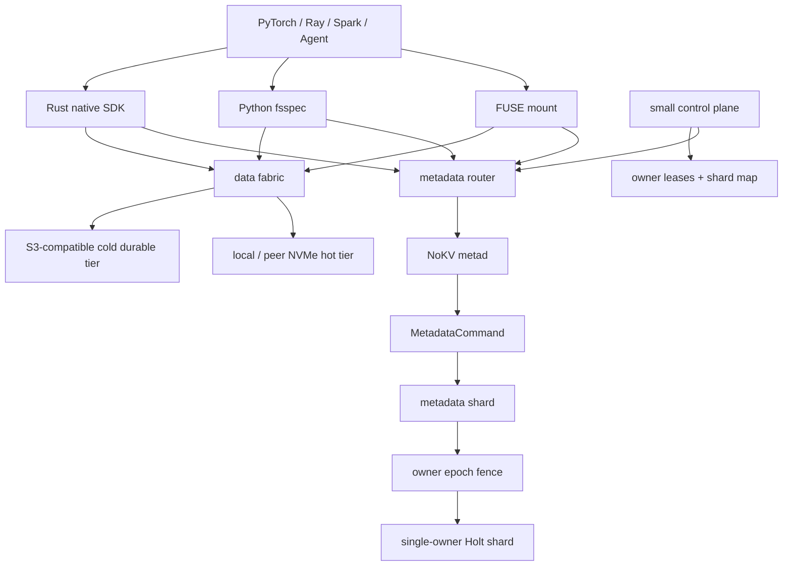

<!--
Copyright 2024-2026 The NoKV Authors.
SPDX-License-Identifier: Apache-2.0
-->

# Product Design

NoKV is a Rust filesystem for AI training and agent workspaces. It presents a
file interface, keeps namespace metadata in Holt, and stores file bodies in
external object storage.

The product is not a generic distributed KV database, a full NAS replacement,
or a raw S3 mount. It owns filesystem metadata semantics and delegates byte
durability to local or S3-compatible object storage.

## Product Boundary

```text
NoKV
  owns:
    namespace truth
    inode/dentry metadata
    metadata command atomicity
    body descriptors
    checkpoint/artifact publish points
    layout leases and block read plans
    watch/snapshot/cache invalidation metadata

  delegates:
    file body durability
    object replication
    object lifecycle storage
    NVMe residency and transport placement as soft data-plane state
```

This keeps the system focused. Object stores already provide elastic byte
storage. NoKV adds the metadata layer that object stores do not provide:
fast directory state, atomic path publication, typed workspace events, and
mountable namespace views.

## HOLT Role

Holt is the metadata storage engine. It is not the whole metadata service.

```text
NoKV metad
  inode/dentry semantics
  MetadataCommand validation
  watch/snapshot/GC policy
  publish and remove semantics
  service and client APIs

Holt
  local ordered metadata engine
  ART prefix/range lookup
  atomic batch
  WAL/checkpoint/recovery
```

This separation matters because the filesystem semantics must remain above the
storage engine. The `nokv-meta` crate may bind those semantics to Holt. The
types, object, client, and FUSE crates must not leak Holt internals.

## Reference Shape

NoKV borrows the proven split used by object-backed filesystems: metadata is
separate from bytes, and clients can access the namespace through FUSE or a
native SDK.

```text
AI training / agent process
  -> FUSE, Rust SDK, or Python/fsspec
  -> NoKV metadata service
  -> Holt metadata engine
  -> NoKV data fabric
  -> local NVMe hot blocks and S3-compatible cold blocks
```

FUSE is the mounted-file path. Native clients are the performance path for data
loaders, checkpoint writers, Ray jobs, and agent runtimes that can call a
library directly.

## Target Architecture



The current implementation is a client/server `metad` path backed by a
**single-node** embedded Holt MVCC engine — there is no replication and no
consensus group. The object-backed metadata archive (backup/restore) is
implemented; production multi-node operation (subtree sharding, owner-lease +
epoch fencing) remains the distributed hardening work described under Metadata
Distribution.

## Kubernetes Deployment Target

The cloud-native deployment should grow into these components:

```text
nokv-server
  long-running metadata service, health/control plane, and future router

nokv-csi
  Kubernetes volume lifecycle and node mount integration

nokv-cache-agent
  node-local metadata/object cache for GPU and training nodes

nokv-gc-controller
  staged object cleanup, checkpoint retention, and orphan body GC

nokv-python
  Python SDK and fsspec binding for training frameworks
```

The current repository implements a long-running `nokv-server`, framed
metadata RPC for the Rust SDK and CLI, and a FUSE frontend that uses the same
metadata client/server boundary. CSI, Python/fsspec, node-local cache, and
production multi-node metadata operations remain product direction.

## Metadata Distribution

The first distributed version shards by subtree (a mount, or a subtree within a
mount) — one single-owner Holt engine per shard. Shards are *not* consensus-
replicated: a small control group grants owner-leases and holds the kilobyte
shard map, and a monotonic epoch fences a deposed owner at the commit boundary.
Failover restores a shard's Holt checkpoint image from object storage (the same
mechanism as metadata DR) onto a new owner.

```text
client
  -> metadata router
  -> shard owner
  -> owner epoch fence
  -> Holt atomic batch apply
  -> watch/cache invalidation event
  -> response
```

Later versions may split one mount into subtree or workload shards:

```text
dataset namespace shard
checkpoint namespace shard
large directory shard
workspace/channel shard
```

Cross-shard rename and cross-mount atomic transactions are not part of the
first distributed target. Same-shard rename remains atomic. Cross-shard rename
can return `EXDEV` until a handoff or transaction protocol exists.

## Data Fabric

NoKV's metadata manifest names immutable block identity and durable object
location. It does not name a specific NVMe device or cache slot. Those are
data-plane placements and can change without a metadata commit.

```text
metadata truth:
  inode, generation, logical offsets, block digest, S3 object key

soft placement:
  block digest -> local hot-tier presence / ttl / health
```

The first data-fabric skeleton is already in `nokv-object`: `LocalObjectStore`
is the node-local NVMe-shaped hot tier and `TieredObjectStore` fronts it with a
cold durable object backend. Reads check hot placement first, fall back to
S3-compatible storage, can refresh the hot tier on full-object reads, and use
`ObjectStore::get_many` to fetch coalesced read-plan ranges in one object-layer
batch. The hot tier now has a process-local residency index rebuilt from disk on
open, optional max-byte admission with LRU eviction, and inline or background
hot-fill modes with in-flight duplicate-key coalescing. `resolve_block_placements`
currently marks blocks as `LocalNvmeRead` or `ObjectTcpGet` from local hot-tier
presence; it is soft placement state, not a metadata record. `LayoutReadExecutor`
now makes this the SDK read path for layout-open plans and exposes transport,
tiered-backend, and local-hot residency counters for the native data plane.
The current transport surface is intentionally small:

```text
ObjectTcpGet        S3-compatible cold read
LocalNvmeRead       node-local hot-tier read
```

The metadata service only returns the layout lease and block descriptors. The
client-side data fabric chooses the fastest available transport for each block.
If every hot transport misses or fails, S3 remains the durable fallback.

## Metadata Model

The canonical namespace model is inode/dentry, not full path as the source of
truth.

```text
inode:
  mount | inode -> attributes and body summary

dentry:
  mount | parent_inode | name -> child inode and projection

manifest:
  mount | inode | generation | chunk -> block descriptors

watch:
  mount | scope | sequence -> typed event

snapshot:
  mount | snapshot_id -> read frontier and retention pin

gc:
  mount | enqueue_version | inode | generation | chunk | block -> pending cleanup record
```

Full-path indexes are derived accelerators for artifact and checkpoint lookup.
They are not namespace truth because subtree rename must not require rewriting
every descendant path.

## Version Plan

```text
v0 local:
  Holt-backed metadata
  S3-compatible object backend, with RustFS as the local default
  Rust SDK
  CLI
  long-running local server with health, stats, manual GC endpoints, and
  framed metadata RPC plus HTTP health, stats, and manual GC control endpoints
  Rust metadata client for path and inode namespace operations
  Rust file client for direct object upload, metadata publish, body read
  plans, and direct object range reads
  native layout-open RPCs, read lease RPC, ordered batched read-plan RPC, and
  digest-carrying block read plans
  close-to-open FUSE reads and buffered writes
  artifact publish
  durable object GC queue, explicit cleanup API, and background worker
  durable snapshot pin, snapshot-version artifact read, and history GC
  remove/rmdir/rename-replace
  durable typed watch replay
  FUSE kernel entry/inode invalidation from typed watches
  read-only FUSE snapshot mounts

v1 usable filesystem:
  native zero-copy read client over the layout-open boundary
  JuiceFS-style chunk/slice data path with bounded buffers and background flush
  fuller FUSE semantics beyond buffered write publish
  FUSE over the metadata server
  Python/fsspec
  SDK watch consumer integration

v2 cluster:
  metadata router
  subtree-sharded single-owner Holt metadata shards
  control-plane owner leases and epoch fencing
  CSI
  node-local cache
  watch-driven invalidation

v3 AI platform:
  tiered NVMe/S3 data fabric
  checkpoint retention
  dataset prefetch policy
  workspace scoped views
  metrics, audit, lineage, and lifecycle controllers
```
