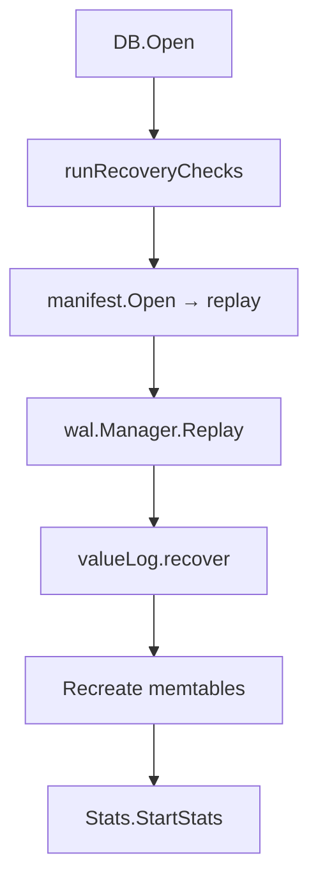

# Crash Recovery Playbook

This playbook documents how NoKV rebuilds state after a crash and which automated checks ensure correctness. It ties together WAL replay, manifest reconciliation, ValueLog GC, and flush pipelines—mirroring RocksDB's layered recovery while incorporating Badger-style value log hygiene.

---

## 1. Recovery Phases



1. **Directory verification** – `DB.runRecoveryChecks` calls `manifest.Verify`, `wal.VerifyDir`, and initialises the vlog directory. Missing directories fail fast.
2. **Manifest replay** – `manifest.Open` reads `CURRENT`, replays `EditAddFile/DeleteFile`, `EditLogPointer`, and vlog edits into an in-memory `Version`.
3. **WAL replay** – `wal.Manager.Replay` processes segments newer than the manifest checkpoint, rebuilding memtables from committed entries.
4. **ValueLog reconciliation** – `valueLog.recover` scans existing `.vlog` files, drops segments marked invalid, and trims torn tails to the last valid entry.
5. **Flush backlog** – Immutable memtables recreated from WAL are resubmitted to `flush.Manager`; temporary `.sst.tmp` files are either reinstalled or cleaned up.
6. **Stats bootstrap** – the metrics goroutine restarts so CLI commands immediately reflect queue backlogs and GC status.

This mirrors RocksDB's `DBImpl::Recover` while extending to handle value log metadata automatically.

---

## 2. Failure Scenarios & Expected Outcomes

| Failure Point | Example Simulation | Expected Recovery Behaviour | Tests |
| --- | --- | --- | --- |
| WAL tail truncation | truncate last 2 bytes of `000005.wal` | Replay stops at truncated record, previously flushed SST remains intact | `wal/manager_test.go::TestReplayTruncatedTail` |
| Flush crash before install | crash after writing `.sst.tmp` | WAL replay rebuilds memtable; temp file removed; no manifest edit present | `db_recovery_test.go::TestRecoveryWALReplayRestoresData` |
| Flush crash after install | crash after logging manifest edit but before WAL release | Manifest still lists SST; recovery verifies file exists and releases WAL on reopen | `db_recovery_test.go::TestRecoveryCleansMissingSSTFromManifest` |
| ValueLog GC crash | delete edit written, file still on disk | Recovery removes stale `.vlog` file and keeps manifest consistent | `db_recovery_test.go::TestRecoveryRemovesStaleValueLogSegment` |
| Manifest rewrite crash | new MANIFEST written, CURRENT not updated | Recovery keeps using old manifest; stale temp file cleaned | `db_recovery_test.go::TestRecoveryManifestRewriteCrash` |
| Transaction in-flight | crash between WAL append and memtable update | WAL replay reapplies entry; transactions remain atomic because commit order is vlog → WAL → memtable | `txn_test.go::TestTxnCommitPersists` |

---

## 3. Automation & Tooling

### 3.1 Go Test Matrix

```bash
GOCACHE=$PWD/.gocache GOMODCACHE=$PWD/.gomodcache go test ./... -run 'Recovery'
```

- Exercises WAL replay, manifest cleanup, vlog GC, and managed transaction recovery.
- Set `RECOVERY_TRACE_METRICS=1` to emit structured logs (key/value pairs) for each scenario.

### 3.2 Shell Script Harness

`scripts/recovery_scenarios.sh` orchestrates the matrix end-to-end:
1. Spins up a temporary database, injects writes, and crashes at chosen checkpoints.
2. Reopens the database and validates via CLI (`nokv stats`, `nokv manifest`, `nokv vlog`).
3. Archives logs under `artifacts/recovery/<scenario>.log` for CI inspection.

### 3.3 CLI Validation

- `nokv manifest --workdir <dir>`: confirm WAL checkpoint, level files, vlog head.
- `nokv stats --workdir <dir>`: observe flush backlog drop to zero after replay.
- `nokv vlog --workdir <dir>`: ensure stale segments disappear after GC recovery.

These commands give the same insight as RocksDB's `ldb manifest_dump` or Badger's CLI but with JSON output for automation.

---

## 4. Metrics Emitted During Recovery

When `RECOVERY_TRACE_METRICS=1`:
- `RECOVERY_METRIC phase="manifest" ...` – manifest replay progress.
- `RECOVERY_METRIC phase="wal" segment=... offset=...` – WAL records applied.
- `RECOVERY_METRIC phase="vlog_gc" fid=... action="delete"` – vlog cleanup status.

`StatsSnapshot` also exposes:
- `NoKV.Flush.Queue` – remaining flush tasks.
- `NoKV.ValueLog.HeadFID` – head file after recovery.
- `NoKV.Txns.Active` – should reset to zero post-recovery.

---

## 5. Comparison with RocksDB & Badger

| Aspect | RocksDB | BadgerDB | NoKV |
| --- | --- | --- | --- |
| WAL replay | `DBImpl::RecoverLogFiles` replays per log number | Journal (value log) is replayed into LSM | Dedicated WAL manager with manifest checkpoint, plus vlog trim |
| Manifest reconciliation | Removes missing files, handles CURRENT rewrite | Minimal manifest (mainly tables) | Tracks SST + vlog metadata; auto-cleans missing SST/vlog |
| Value log recovery | Optional (BlobDB) requires external blob manifest | Primary log, re-scanned on start | Manifest-backed head + discard stats to avoid rescan |
| Tooling | `ldb` for manifest dump | `badger` CLI | `nokv` CLI with JSON output |

NoKV inherits RocksDB's strict manifest semantics and Badger's value log durability, yielding deterministic restart behaviour even under mixed workloads.

---

## 6. Extending the Matrix

Future enhancements to cover:
- **Compaction crash** – simulate partial compaction output and verify manifest rollback.
- **Prefetch queue state** – ensure hot-key prefetch map resets cleanly.
- **Raft integration** – once replication is added, validate raft log catch-up interacts correctly with WAL replay.

Contributions adding new recovery scenarios should update this document and the shell harness to keep observability aligned.
