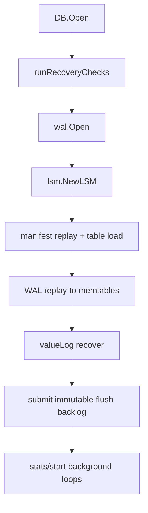

# Crash Recovery Playbook

This document describes how NoKV restores state after abnormal exit, and which tests validate each recovery contract.

---

## 1. Recovery Phases


```mermaid
flowchart TD
    Start[DB.Open]
    Verify[runRecoveryChecks]
    WalOpen[wal.Open]
    LSM[lsm.NewLSM]
    Manifest[manifest replay + table load]
    WALReplay[WAL replay to memtables]
    VLog[valueLog recover]
    Flush[submit immutable flush backlog]
    Stats[stats/start background loops]

    Start --> Verify --> WalOpen --> LSM --> Manifest --> WALReplay --> VLog --> Flush --> Stats
```

1. **Pre-flight verification**: `DB.runRecoveryChecks` runs `manifest.Verify`, `wal.VerifyDir`, and per-bucket `vlog.VerifyDir`.
2. **WAL manager reopen**: `wal.Open` reopens latest segment and rebuilds counters.
3. **Manifest replay + SST load**: `levelManager.build` replays manifest version and opens SST files.
4. **Strict SST validation**: if a manifest SST is missing or unreadable/corrupt, startup fails and manifest state is left unchanged.
5. **WAL replay**: `lsm.recovery` replays post-checkpoint WAL records into memtables.
6. **Flush backlog restore**: recovered immutable memtables are resubmitted to the flush queue.
7. **ValueLog recovery**: value-log managers reconcile on-disk files with manifest metadata, trim torn tails, and drop stale/orphan segments.
8. **Runtime restart**: metrics and periodic workers start again.

---

## 2. Failure Scenarios & Tests

| Failure Point | Expected Recovery Behaviour | Tests |
| --- | --- | --- |
| WAL tail truncated | Replay stops safely at truncated tail, preserving valid prefix records | `engine/wal/manager_test.go::TestManagerReplayHandlesTruncate` |
| Crash before memtable flush install | WAL replay restores user data not yet flushed to SST | `db_test.go::TestRecoveryWALReplayRestoresData` |
| Manifest references missing SST | Startup removes stale manifest entry and continues | `db_test.go::TestRecoveryCleansMissingSSTFromManifest` |
| Manifest references corrupt/unreadable SST | Startup removes stale entry and continues | `db_test.go::TestRecoveryCleansCorruptSSTFromManifest` |
| ValueLog stale segment (manifest marked invalid) | Recovery deletes stale file from disk | `db_test.go::TestRecoveryRemovesStaleValueLogSegment` |
| ValueLog orphan segment (disk only) | Recovery deletes orphan file not tracked by manifest | `db_test.go::TestRecoveryRemovesOrphanValueLogSegment` |
| Manifest rewrite interrupted | Recovery keeps using CURRENT-selected manifest and data remains readable | `db_test.go::TestRecoveryManifestRewriteCrash` |
| ValueLog contains records absent from LSM/WAL | Recovery does not replay vlog as source-of-truth | `db_test.go::TestRecoverySkipsValueLogReplay` |

---

## 3. Recovery Tooling

### 3.1 Targeted tests

```bash
go test ./... -run 'Recovery|ReplayHandlesTruncate'
```

Set `RECOVERY_TRACE_METRICS=1` to emit `RECOVERY_METRIC ...` lines in tests.

### 3.2 Targeted harness command

```bash
RECOVERY_TRACE_METRICS=1 \
go test ./... -run 'TestRecovery(RemovesStaleValueLogSegment|CleansMissingSSTFromManifest|ManifestRewriteCrash|SlowFollowerSnapshotBacklog|SnapshotExportRoundTrip|WALReplayRestoresData)' -count=1 -v
```

Outputs are saved under `artifacts/recovery/`.

### 3.3 CLI checks

- `nokv manifest --workdir <dir>`: verify level files, WAL pointer, vlog metadata.
- `nokv stats --workdir <dir>`: confirm flush backlog converges.
- `nokv vlog --workdir <dir>`: inspect vlog segment state.

---

## 4. Operational Signals

Watch these fields during restart:

- `flush.queue_length`
- `wal.segment_count`
- `value_log.heads`
- `value_log.segments`
- `value_log.pending_deletes`

If `flush.queue_length` remains high after replay, inspect flush worker throughput and manifest sync settings.

---

## 5. Notes on Consistency Model

- WAL + manifest remain the authoritative recovery chain for LSM state.
- ValueLog is reconciled/validated but is not replayed as a mutation source.
- In strict flush mode (`ManifestSync=true`), SST install ordering is `SST Sync -> RenameNoReplace -> SyncDir -> manifest edit`.

For deeper internals, see [flush.md](flush.md), [manifest.md](manifest.md), and [wal.md](wal.md).
