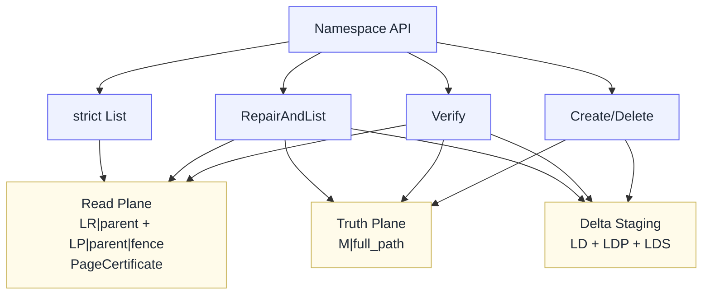
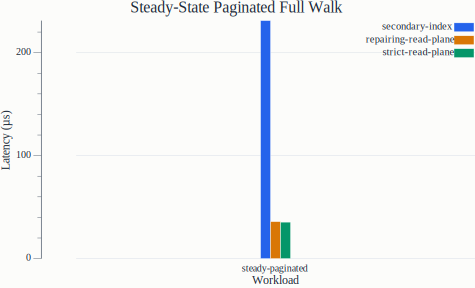
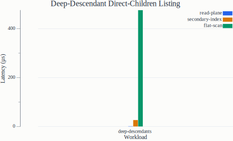
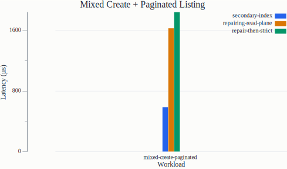
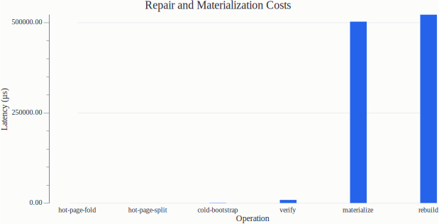

# Proof-Gated Paginated Listing on an LSM Host

## 摘要

既有 LSM-backed KV 很擅长 point lookup 与 ordered range scan，但对 `list(dir)` 这类 hierarchy-aware、direct-children、并且需要稳定分页的命名空间工作负载，它通常只能退化为对 `M|full_path` 的前缀扫描，再在上层过滤 direct children。这个执行路径不仅在 deep descendants 和 mixed create+paginated-list 场景下代价较高，还缺乏明确的回答资格边界：系统往往只能回答“现在有没有一个结构可读”，却很难回答“这一页当前是否有资格作为完整结果被返回”。本文提出一种更窄但更硬的 retrofit：保留 `M|full_path` 作为唯一 authoritative truth，在其上构建一个 completeness-certified 的 fence-paged namespace read plane。换句话说，**我们不是在提出一个更好的 namespace index；我们提出的是一个运行在 single-truth LSM host 上、面向 paginated hierarchical listing 的 proof-gated answerability contract。** 系统用 `LR|parent` 与 `LP|parent|fence` 组织按 lexical interval 切分的持久化页，用 cold-parent `LD|parent|shard|child` 与 steady-state `LDP|parent|page|#seq` 维护 recent mutations，并用 page certificate、root-level publication generation 与 page publication frontier 共同定义 listing answerability：只有被证明完整覆盖的区间才允许 direct answer，未认证区间必须进入显式 repair/bootstrap 路径，而不能静默 fallback 成正常 truth scan。我们在真实 NoKV 宿主路径上实现了该设计，而不替换主引擎或修改 flush/compaction contract。在 `2048` children、`64` entry page、`128` read-plane page、`256×16` deep-descendant 的配置下，read plane 在 deep-descendant direct-children workload 上将 listing 从 flat scan 的 `476.3 us/op` 降至 `1.75 us/op`，并优于 durable parent-child secondary-index baseline 的 `27.2 us/op`；steady-state paginated full walk 也从 durable parent-child secondary index 的 `231 us/op` 降至 `35.9 us/op`（repairing）/ `35.4 us/op`（strict）。interval-scoped cold bootstrap 的 first-list latency 为 `1.60 ms/op`，而 hot-page fold / split 仅为 `318 us` / `310 us`，相比 full materialize / rebuild 的 `504–523 ms/op` 低两个数量级。当前 prototype 仍然最弱于 mixed create+paginated-list：repairing path 为 `1.63 ms/op`，repair-then-strict 为 `1.84 ms/op`，而同一 workload 下 durable parent-child secondary-index baseline 为 `589 us/op`。因此，本文当前的 strongest claim 不是“所有 workload 都最优”，而是：在真实单机 LSM 宿主上，proof-gated answerability、explicit absence-of-proof，以及 page-local repair 可以与 very fast steady-state listing path 共存。

## 1. 引言

许多 metadata-on-KV 系统都把路径型命名空间落在普通 key-value 宿主上：对象存储的 bucket/object namespace、文件系统的 metadata service、任务系统的 checkpoint tree、甚至一些控制面状态都可以压成 `full_path -> metadata` 的形式。这种建模对 point lookup 非常自然，但对 `List(parent)` 这样的目录枚举并不自然。`List(parent)` 至少同时要求三件事：它关心的是 direct children，而不是所有共享前缀的后代；它需要稳定 pagination，而不是一次性全量扫描；它经常与 create/delete 并发出现。

这些要求与 LSM 的原生优势并不完全一致。LSM 宿主善于 point lookup、ordered range scan，以及 WAL/memtable/SST 的分层维护，但并不天然理解 “direct children of `/a/b`” 这样的层级语义。最直接的实现方式是继续对 `M|full_path` 做 prefix scan，再在上层过滤 direct children。这条路在工程上完全可行，但它有两个结构性问题。第一，它扫描的是共享前缀的 truth keys，而不是该目录当前页真正需要的 child-set；第二，它很难回答一个更基础的问题：**这一页现在到底有没有资格被回答？**

这个问题决定了本文的切入点。我们并不把工作定义为“做一个更快的 listing index”，而是定义为：**在不改变既有 LSM truth model 的前提下，能否把 paginated hierarchical listing 做成一个带 completeness proof 的 queryability contract？** 更压缩地说，本文的主张就是：**We are not proposing a better namespace index; we are proposing a proof-gated answerability contract for paginated hierarchical listing on a single-truth LSM host.** 也就是说，页能否回答，不应该只取决于“有没有一页可读”，而应该取决于“这个 lexical interval 是否已经被证明完整覆盖”。在当前 prototype 中，这个证明主要体现为页级 coverage state、dirty-page exclusion、root/ref/page generation coherence，以及 publication frontier consistency：strict `List` 会同时检查 root generation 是否覆盖该页证书的 generation、ref/page frontier 是否一致，并拒绝 publication frontier 落后于该页 page-local delta 序号的页。

本文提出一种 completeness-certified fence-paged namespace read plane。它保留 `M|full_path` 为唯一 authoritative truth，在其上增加三类非权威状态：

- `LR|parent`：目录级 read-plane root，承载页目录与 coverage state；
- `LP|parent|fence`：按 lexical interval 切分的持久化 ordered micro-pages；
- `LD` / `LDP`：分别承载 cold parent 与 materialized parent 的 recent mutations。

这一设计的关键不在于“多存一份 children”，而在于同时建立三条边界：

1. **Proof-gated answerability**：只有 covered interval 才能 direct answer。
2. **Explicit uncovered state**：未认证区间是 absence of proof，而不是普通性能 miss。
3. **Page-local maintainability**：recent writes 只污染目标页，而不使整个 parent read plane 失效。

本文的贡献可以概括为三点：

1. 提出一种 completeness-certified fence-paged namespace read plane，把 paginated hierarchical listing 从 best-effort acceleration 提升为 proof-gated queryability contract。
2. 提出一种轻量 coverage/publication 语义：系统显式区分 covered 与 uncovered lexical interval，并要求未认证区间不得作为正常 listing 命中路径。
3. 在真实 NoKV 路径上实现 page-local delta maintenance，并表明其能够把 cold bootstrap、hot-page fold/split 与 full materialize/rebuild 清楚分离成不同数量级的 repair primitive。

## 2. 背景与动机

### 2.1 直接 truth scan 的结构性局限

对 `M|full_path` 直接做前缀扫描并不“不正确”；问题在于代价形状与服务语义都不理想。对某个 parent 的 prefix scan 会把所有共享前缀的 descendants 都带上来，而 direct-children 只是其中一小部分。对于 deep descendants 的目录，这意味着系统为回答一页 direct-children 要先读出一个更大的 truth key 集，再在上层去重、裁剪和分页。这样的路径天然不对齐于 directory page。

### 2.2 普通 secondary index 仍然不够

一个耐久的 `parent -> child` secondary index 会比 flat scan 快很多，但它通常仍然只回答“命中时更快”，而不回答“这一页是否已被证明完整”。对系统论文来说，这种缺口很重要。普通 index 的 miss 只是慢路径；本文要强调的是：**未被证明完整的 lexical interval 不是普通 miss，而是 absence of proof。** 如果系统在这种状态下继续把 truth scan 当作正常 steady-state fallback，它仍然更像一个工程上做得不错的 listing accelerator，而不是一个有明确回答资格边界的 listing service。

### 2.3 目标与非目标

本文的目标是：

- 保留 `M|full_path` 为唯一 truth；
- 不修改 NoKV 的 flush/compaction contract；
- 将 paginated hierarchical listing 的回答资格绑定到 completeness proof；
- 将 recent-mutation 的维护成本限制在 page-local 范围内。

本文明确不做：

- rename / subtree move；
- directory identity / dual-authority namespace；
- log-derived namespace replica；
- 分布式 epoch 协议或全局 visibility barrier。

## 3. 设计概览

### 3.1 数据布局

```text
M|full_path           -> metadata truth
LD|parent|shard|child -> bootstrap delta for unmaterialized parents
LR|parent             -> read-plane root + coverage descriptor
LP|parent|fence       -> ordered fence page
LDP|parent|page|#seq  -> append-style page-local delta log
```

其中：

- `M` 保存 authoritative truth；
- `LD` 为 cold parent 的 bootstrap delta；
- `LR` 保存页目录与页级 coverage/publication metadata；
- `LP` 保存已 publish 的 ordered pages；
- `LDP` 保存 materialized parent 上的 page-local recent mutations。

### 3.2 三层状态机

从服务语义上看，这套系统只有三层状态：

1. **Truth**：`Lookup(path)` 永远只依赖 `M`。
2. **Strict read plane**：`List(parent)` 只读 covered `LR/LP`。
3. **Explicit repair/bootstrap**：当区间 uncovered 或页 dirty 时，系统进入 repair path，而不是 silent fallback。

对外 API 也遵循这三层分工：`List` 是 strict contract-bearing 接口；`RepairAndList` 是显式 repair primitive。当前实现中，默认 `List` 已与 strict certified path 对齐，不再自动 repair。

这三层状态的分离是本文的核心。页是否能回答，是一个显式状态，不再是一个“内部会自己修好”的隐式工程判断。



*图 0：简化架构总览。系统只保留三类持久化状态：truth plane、proof-gated read plane、以及 delta staging。strict `List` 只读 read plane；`RepairAndList` 从 truth 与 delta state 显式修复 uncovered interval；`Verify` 审计这三层状态的一致性。*

## 4. Answerability Contract

### 4.1 Covered interval

对某个 parent，`LR` 定义一组按 lexical order 排列的页引用。当前实现把每个 interval 的回答资格显式收成一个轻量 `PageCertificate`：它至少包含该页的 `[low, high)` lexical interval、coverage state、publication frontier，以及 publication generation。除此之外，`LR` 自身还维护一个 root-level publication generation，用来表达“当前 root 至少已经发布到哪一代页证书”。strict `List` 不再分别零散地信任这些字段，而是先验证该 interval 对应的 certificate，以及其 generation 是否受当前 root generation 支持，再决定该页是否具备 direct answerability。

### 4.2 Publication Metadata

当前实现为每个 interval certificate 维护 `PublishedFrontier`。它是一个轻量、单调的 publication metadata，而不是复杂的分布式 epoch。它表达这样一条审计约束：

> 若某页声称在 publication frontier `e` 上完整，则所有影响该页区间且序号 `<= e` 的已消费 mutations 都已经被并入该页的可见状态。

在当前 prototype 中，strict `List` 的直接判定由两层组成。第一层是 interval certificate 本身：`Covered`、interval fence、publication generation，以及 `PublishedFrontier` 必须在 root/page 间保持一致，同时该页 certificate 的 generation 不得超过 root-level publication generation。第二层是 dirty-page exclusion：该页不得存在 pending page-local delta，并且 certificate 上的 `PublishedFrontier` 不得落后于该页当前可见的 page-local delta 序号；否则该 interval 会被视为 uncertified。

### 4.3 No silent fallback

本文最重要的 contract 是：

- covered interval：允许 direct answer；
- uncovered interval：必须显式 repair/bootstrap 或 fail-stop；
- truth scan：只能作为 repair/bootstrap primitive，而不是 steady-state certified answer path。

这条约束把 listing 从 best-effort acceleration 变成了一个带回答资格边界的服务。

### 4.4 可审计的不变量

为了把 publication metadata 从“实现细节”提升为可审计的系统边界，本文依赖以下三条不变量：

1. **Certified-page invariant**：对任一 `ReadPageRef`，若 `Covered=true` 且 `PublishedFrontier=e`，则该 `[low, high)` interval 上所有相关且 `seq <= e` 的 mutations 都必须已经反映在对应 `LP` 页状态中。
2. **Dirty-page exclusion invariant**：若某 interval 上仍存在未消费的 relevant `LDP` backlog，或 root/page 元数据不一致，则该 interval 必须视为 uncovered；strict `List` 不允许返回该页。
3. **Repair transition invariant**：`RepairAndList` 的职责不是构造一个 best-effort view，而是把 interval 从 uncovered 迁移回 covered，并在成功 publish 后推进 frontier。

这些不变量使 `PublishedFrontier` 不只是装饰字段；它已经作为 `PageCertificate` 的一部分进入 strict read 与 `Verify` 的核心判定，并参与 publish/repair 过程中的单调性与审计边界。与此同时，root-level publication generation 也开始承担协议角色：它界定了当前 root 允许承认的最大页证书代次。当前 prototype 仍未把 `PublishedFrontier` 做成唯一 proof object，因为 coverage、dirty-page exclusion 与 generation consistency 仍然同等重要。

### 4.5 Client-visible contract

本文的 contract 不能只停留在内部实现语义，还必须外化为调用者可观察的规则。当前 prototype 的客户端可见语义可以收成四条。

1. **`List(parent, cursor, limit)` 只返回当前已认证区间上的 direct children。** 若请求命中的 lexical interval 尚未 covered，或对应页存在 dirty/publication mismatch，则调用必须返回 `ErrCoverageIncomplete` 或 fail-stop error，而不是静默退回 truth scan。
2. **continuation token 只是 strict read plane 上的继续位置，不承诺“跨并发 mutation 的快照稳定性”。** 它表达的是“从当前已发布页序列继续前进”，而不是一个全局 snapshot handle。因此，在 repair 前后，cursor 指向的页可能被替换、split、或重新发布。
3. **并发 create/delete 下的保证是“拒答优先于答错”，而不是“永远返回最新全局快照”。** 若写入使目标页进入 dirty/uncovered 状态，则 strict `List` 会拒答该区间；调用者若需要继续前进，必须显式调用 `RepairAndList` 或等待后台 materialization/rebuild。
4. **`RepairAndList` 的 contract 是把区间从 uncovered 迁移回 covered，然后再按 strict 规则回答。** 它不是“读不到就临时扫描 truth”的便利入口，而是一个显式状态迁移 primitive。repair 后允许页边界、page ID、以及 continuation token 变化，但不允许 silent fallback 掩盖 absence-of-proof。

换句话说，本文的核心不是“页存在即可返回”，而是“页只有在被证明当前可答时才允许返回”。这条边界对调用者是可见的：结果、拒答、repair、以及 cursor 失效/推进，都必须围绕 answerability contract 来理解。

## 5. 维护机制

### 5.1 Cold parent

当 parent 尚未 materialize 时，`Create/Delete` 更新：

1. `M|path`
2. `LD|parent|shard|child`

此时系统尚未发布 certified pages，`List(parent)` 会返回 `ErrCoverageIncomplete`；只有显式 `RepairAndList(parent)` 才会进入 repair path。当前实现中的 cold-parent repair 已经支持最小的 interval-scoped bootstrap：它会先从 `M|parent/...` 的有序 truth 空间按窗口提取当前请求所需的 direct children，再发布满足该窗口的一段 covered interval，并把 remainder 显式保留为 uncovered，而不是一开始就把整个 parent 完整 materialize。

### 5.2 Materialized parent

当 parent 已 materialize 后，recent mutations 不再进入 parent-wide backlog，而是被路由到目标页的 `LDP|parent|page|#seq`。同时，对应页在 `LR` 中被标记为 uncovered。这样 recent writes 只污染目标 interval，而不会使整个 parent read plane 失效。

### 5.3 Page-local fold

`MaterializeDeltaPages(parent, n)` 仅选择脏页做局部 fold：

1. 读取该页现有 `LP`；
2. 合并该页的 `LDP`；
3. 必要时 split page 或更新 fence；
4. publish 更新后的 `LR/LP`；
5. 删除已消费的 `LDP`；
6. 把该页重新标记为 covered，并推进 frontier。

因此 steady-state maintenance 的单位是 page，而不是 whole parent。

### 5.4 Rebuild

`Rebuild(parent)` 是最重但最简单的 repair primitive：

1. 从 `M` 重新推导 direct children；
2. 重建整组 `LR/LP`；
3. 清理 `LD/LDP`；
4. 发布新的 covered read plane。

当前实现仍保留这个 primitive，因为本文保留了 single truth 下的 operational simplicity；不同之处在于，它不再被包装为“普通读路径会自动做的 fallback”。

## 6. 实现

我们在真实 NoKV 宿主路径上实现了上述设计。当前实现具有以下特征：

- truth、bootstrap delta、page-local delta 与 read-plane page 都落在真实 NoKV KV 路径上；
- `Create/Delete` 通过真实 mutation batch 进入 WAL/memtable/LSM；
- `List`、`RepairAndList`、`MaterializeDeltaPages`、`Verify`、`Rebuild` 都运行在真实存储引擎宿主上；
- 页发布边界由 `LR` 与 `LP` 的同批次更新保证，而不是靠内存状态伪装。

因此本文讨论的不是纯内存 mock，而是一个运行在真实单机 LSM host path 上的 prototype。

## 7. 正确性与失败语义

本文围绕以下三条不变量组织系统行为：

1. **Single truth**：`M|full_path` 始终是唯一 authoritative truth。
2. **Certified answerability**：一个 lexical interval 只有在 `LR` 明确标记为 covered 时，才允许 direct answer。
3. **No silent fallback**：未 covered interval 不得作为正常 listing 命中路径静默回落到 truth scan。

基于这些不变量，当前实现已经具备：

- `List`：显式拒绝未认证页；
- `RepairAndList`：显式 repair 再回答；
- `Verify`：输出三层子报告，分别检查 membership drift、page certificate consistency，以及 publication consistency；
- `Rebuild`：显式 repair；
- targeted consistency tests：覆盖 uncovered、dirty、corrupted root、missing page 等关键状态。

为了避免把上述 contract 只停留在文字层，当前实现对若干典型 negative path 已经采用显式状态区分，而不是隐式 fallback。表 1 总结了当前系统语义。除此之外，当前 `Verify` 已经不再只是 membership checker：它会分别审计 membership、page certificate 与 publication protocol，并显式报告 generation rollback、root-page cohort mismatch 与 frontier lag。

| 状态 | 典型例子 | `List` | `RepairAndList` | `Verify` / `Rebuild` |
| --- | --- | --- | --- | --- |
| Covered interval | steady-state 已发布页 | 直接返回 | 直接返回或命中 fast path | `Verify` 的 membership / certificate / publication 都应为 clean |
| Uncovered interval | cold parent、dirty page | `ErrCoverageIncomplete` | repair 后再答；cold parent 可先发布局部 covered interval | `Verify` 可报告 uncovered state；必要时 `Rebuild` |
| Corrupted root metadata | `LR` 损坏、codec payload 非法 | fail-stop，返回 `ErrCodecCorrupted` | fail-stop，不伪装成 repair success | `Rebuild` 可恢复 |
| Missing certified page | `LR` 仍引用页，但 `LP` 已丢失 | fail-stop，返回 codec/consistency error | 不静默 truth fallback；要求显式 rebuild | `Rebuild` 可恢复 |
| Root/page inconsistency | root interval 与 page interval 不一致 | fail-stop | fail-stop 或 rebuild-required | `Verify`/`Rebuild` 检测并恢复 |

当前 targeted tests 已覆盖 uncovered parent、dirty page、corrupted root、missing certified page、repair 推进 frontier、stale-but-valid coverage metadata，以及 publish-middle fault 等路径。完整的 negative-path matrix 仍有空间继续补强，但当前实现已经不再是“系统默默修好再答”的隐式模式。

## 8. 评测

### 8.1 环境

所有结果均在 Apple M3 Pro 上通过 Go benchmark 运行获得。除特别说明外，本文使用如下参数：

- `NAMESPACE_CHILDREN=2048`
- `NAMESPACE_MAT_CHILDREN=2048`
- `NAMESPACE_PAGE_SIZE=64`
- `NAMESPACE_READPLANE_PAGE_SIZE=128`
- `NAMESPACE_DEEP_CHILDREN=256`
- `NAMESPACE_DESCENDANTS_PER_CHILD=16`

这些参数代表一个 workshop prototype 的中等规模场景：目录大小足以体现分页和 page-local maintenance，但不追求极端规模。除 cold-start / maintenance cost 这类显式单次操作外，结果均报告 `-count=5` 的中位数；cold bootstrap、materialize、verify、rebuild、hot-page fold/split 则使用 `-benchtime=1x -count=5`，以避免把“重初始化成本型操作”错误地解释成 steady-state throughput。本文的评测目标是验证 contract + mechanism 的可行性，而不是给出 production-scale upper bound。

### 8.2 基线

我们比较三类路径：

1. **FlatScan**：truth-plane prefix scan，再上层过滤 direct children；
2. **Durable Parent-Child Secondary Index**：持久化 `parent -> child` 结构，提供 durable parent-local listing，但不具备 coverage/certification semantics；
3. **Proof-Gated Read Plane**：本文提出的 strict listing path。

这里第二类基线刻意不是 cache，也不是内存加速结构，而是一个 durable 的 parent-child 派生结构。它代表了“在既有 truth 上额外维护一份可分页读结构”的最直接工程路线：key 按 `parent -> child` 编码，分页时通过 parent-local lexical scan 与 continuation cursor 推进；更新时，create/delete 同步维护 parent-child 记录；读取时则像普通 durable secondary index 一样把 miss 视为性能状态，而不是 coverage 状态。本文要说明的不是这类基线“无效”，而是它缺少 answerability contract。

### 8.3 Steady-state paginated listing

在 materialized steady-state 下：

- `BenchmarkNamespaceListSecondaryIndexPaginated`
  - `231 us/op`
- `BenchmarkNamespaceListReadPlaneStorePathPaginated`
  - `35.9 us/op`
  - `32 pages/op`
- `BenchmarkNamespaceListStrictReadPlaneStorePathPaginated`
  - `35.4 us/op`
  - `32 pages/op`



*图 1：steady-state paginated full walk。优化后的 proof-gated read plane 已经明显快于 durable parent-child secondary-index baseline；strict path 与 repairing path 基本重合，说明 steady-state 热路径的主成本已不再来自显式 contract 检查。*

这组结果与旧版本草稿完全相反。当前 prototype 的 paginated full walk 已经明显快于强化后的 durable parent-child secondary-index baseline，而 strict path 与 repairing path 的差距也很小。这说明当前 steady-state whole-directory walk 的关键瓶颈已经被压下去：proof-gated contract 不再天然意味着慢路径，真正留下的主要弱点已经转移到 mixed workload 的 repair/publish 成本。

### 8.4 Deep-descendant direct-children workload

在 deep descendants workload 下：

- `BenchmarkNamespaceListFlatScanDeepDescendants`
  - `476 us/op`
- `BenchmarkNamespaceListSecondaryIndexDeepDescendants`
  - `27.2 us/op`
- `BenchmarkNamespaceListReadPlaneStorePathDeepDescendants`
  - `1.75 us/op`
- `BenchmarkNamespaceListReadPlaneColdStartDeepDescendants`
  - `1.60 ms/op`（fresh DB / `-benchtime=1x`）



*图 2：deep-descendant direct-children listing。proof-gated read plane 既明显优于 flat truth scan，也稳定优于 durable parent-child secondary index；这是本文当前 strongest positive result。*

这是本文当前最强的一组正向结果。对 deep descendants 的 direct-children listing，proof-gated read plane 明显优于 flat scan，也稳定优于 durable parent-child secondary-index baseline。更重要的是，cold-parent repair 已经不是 old whole-parent materialization，而是窗口化 truth 提取 + interval-scoped publication；因此 cold bootstrap 的 first-list latency 虽然仍处于毫秒级，但已经比 full materialize / rebuild 低两个数量级。本文当前最可信的性能主张，也应该围绕这一组 workload 来展开，而不是 whole-directory paginated walk。

### 8.5 Mixed workloads

在 mixed create+paginated-list 下：

- `BenchmarkNamespaceMixedCreatePaginatedListSecondaryIndex`
  - `589 us/op`
- `BenchmarkNamespaceSteadyStateMixedCreatePaginatedListReadPlaneNoKV`
  - `1.63 ms/op`
- `BenchmarkNamespaceSteadyStateMixedCreatePaginatedRepairThenCertifiedNoKV`
  - `1.84 ms/op`



*图 3：mixed create + paginated listing。当前原型在显式 repair/no-silent-fallback 语义下仍然把 repair 限制在局部页，但整体时延明显高于 durable parent-child secondary-index baseline。*

这组结果说明两件事。第一，page-local delta maintenance 的确把 recent-mutation cost 限制在局部页上：repair-then-strict 仍然远轻于 full materialize / rebuild，并没有退化到 whole-parent rebuild。第二，在强化后的 durable parent-child secondary-index baseline 面前，当前 prototype 在 mixed create+paginated-list 上仍然明显更重。也就是说，当前实现现在已经不再输在 steady-state whole walk，而主要输在写后 repair/publish discipline 本身。这也是本文当前需要诚实承认的弱点。

### 8.6 Repair, Materialization, and Rebuild

当前 prototype 的 repair / maintenance primitive 呈现出清楚的数量级分层：

- `BenchmarkNamespaceMaterializeReadPlaneNoKVHotPageFold`
  - `318 us/op`
- `BenchmarkNamespaceMaterializeReadPlaneNoKVHotPageSplit`
  - `310 us/op`
- `BenchmarkNamespaceListReadPlaneColdStartDeepDescendants`
  - `1.60 ms/op`
- `BenchmarkNamespaceVerifyLargeParent`
  - `9.45 ms/op`
- `BenchmarkNamespaceMaterializeReadPlaneNoKV`
  - `504 ms/op`
  - `93.5 MB/op`
  - `124k allocs/op`
- `BenchmarkNamespaceRebuildLargeParent`
  - `523 ms/op`



*图 4：repair / maintenance primitive 的数量级分层。hot-page fold/split 为亚毫秒，interval-scoped cold bootstrap 为约 `1.6 ms`，而 full materialize / rebuild 仍为约 `0.5s`。*

这组结果是本文当前最有说服力的机制证据。当前实现已经把 hot-page fold / split 压到亚毫秒，把 interval-scoped cold bootstrap 压到毫秒级，而 full materialize / rebuild 仍然停留在 `~0.5s` 量级。也就是说，repair path 已经不再是“一旦 uncovered 就几乎等于 whole-parent rebuild”；真正昂贵的仍然是 full-plane construction。对于 workshop prototype，这比“所有路径都更快”更重要，因为它直接支撑了 page-local maintenance 与 explicit repair semantics 的存在意义。

### 8.7 Negative-path checks

除了正向性能结果，我们还对几类最可能破坏 contract 的路径做了 targeted fault-injection checks。

第一类是 **stale-but-valid coverage metadata**：我们在目录页被 recent mutation 污染后，手工把 `LR` 中对应 interval 重新标记为 covered，同时保留该页的 `LDP` backlog。此时 root metadata 在编码上仍然合法，但其 coverage claim 已经语义过期。当前实现中的 strict `List` 会检测该页上是否仍有未消费的 page-local delta state；若存在，则返回 `ErrCoverageIncomplete`，而不是静默返回 stale page。随后 `RepairAndList` 会 fold 对应页并重新 recertify。

第二类是 **publish-middle fault**：我们在 fresh publish 与 page-local fold 的 `kv.Apply(batch)` 中注入部分成功、随后失败的故障，使系统留下 “root 已更新而 page 未完整 publish” 的中间态。当前实现面对这类 root/page mismatch 时，strict `List` 不会退回 truth scan，而是 fail-stop 返回 `ErrCodecCorrupted` 或 `ErrCoverageIncomplete`；显式 `Rebuild` 之后，目录可以恢复到 covered 状态。

这些负向结果的重要性不在于吞吐量，而在于它们说明：本文的 contract 不只在“正常 benchmark”里成立，也开始对 stale metadata 和 publish-middle inconsistency 给出可观测、可拒答、可修复的系统行为。

## 9. 讨论

### 9.1 为什么这不只是一个更快的 index

如果系统只是增加一个 persisted `parent -> child` 索引，它当然也可能变快；但它仍然没有回答：**当前页到底有没有资格作为完整结果被返回。** 本文的区别在于：

- 页结果的 direct answer 受 `Covered` 约束；
- 未认证区间必须 repair，而不是 silent fallback；
- recent writes 被 page-local 化，不会使整个 parent read plane 失效。

因此，本文更准确的位置不是 “a better persisted index”，而是 “a proof-gated listing plane on top of a single-truth LSM host”。

### 9.2 当前最弱点

当前系统最弱的一点已经很明确：

- steady-state read 强；
- repair/reject 边界清楚；
- page-local fold 很轻；
- 但 full materialize / rebuild 仍然偏重。

因此接下来的工作重点不再是“证明 read path 能不能跑”，而是降低 cold rebuild 的 CPU 与写放大。

### 9.3 为什么 mixed path 仍慢于 durable secondary index

当前结果已经说明：本文不该再把性能故事写成 “proof-gated read plane 仍普遍慢于 durable secondary index”。更准确的结论是：在 steady-state paginated full walk 与 deep-descendant direct-children 场景下，当前 prototype 已经明显快于强化后的 durable baseline；但在 mixed create+paginated-list 上，当前 prototype 仍然输给 durable parent-child secondary index。根据实现路径与 benchmark 形状，这种落后主要来自三个地方。

第一，**mixed workload 的主成本已经集中到 explicit page repair，而不是 steady-state strict walk**。secondary index 在每次 create 后只需再维护一个 `S|parent|child` 记录，然后继续沿同一 ordered structure 做 seek/resume；当前 prototype 则会把写入路由到 `LDP/LDS`，随后由 `RepairAndList` 进入局部页 repair/fold，再回到 strict path。steady-state whole-directory walk 已经被压到 `35 us/op` 量级，而 mixed repairing path 仍在 `1.63 ms/op` 左右，这说明当前剩余惩罚几乎都来自写后 repair discipline 与页级 publish。

第二，**dirty-page fold 仍然比 secondary-index 的增量维护重得多**。secondary index 的写后代价主要是追加一个 durable `parent -> child` 记录；当前 prototype 则需要重建受影响页的 ordered entries、重新发布 root/page metadata，并清理对应的 page-local delta state。即使 repair 范围已经被限制在局部页上，这条路径仍然会产生比 secondary index 更高的分配和发布成本。

第三，**strict contract 的存在仍然要求 repair 后重新回到 certified serving shape**。本文主张的是 proof-gated answerability，而不是“写后先临时回答，后台慢慢修”。因此 mixed path 的代价里天然包含 “repair 完成后才能继续 strict serve” 的协议成本。现有数据表明，strict 与 repairing steady-state 差距已经很小，所以接下来真正该优化的不是先退掉 contract，而是继续把 dirty-page fold、root/page republish，以及 repair 后的对象分配做轻。

## 10. 相关工作

本文与几类工作相关，但不与它们完全同构。对本文最重要的 carving 不是“谁也做过分页或索引”，而是下面四个维度：**truth placement**、**listing contract**、**repair semantics**、以及 **pagination answerability**。表 2 总结了这几条路线的边界。这里最接近的工作包括 TableFS、GIGA+、IndexFS、DeltaFS，以及 durable parent-child secondary index 这类工程常见做法；它们分别对应 metadata-on-KV substrate、directory partitioning、distributed metadata scalability、以及 truth 上方的 durable derived view [R1-R5]。

| 系统 / 路线 | truth placement | 主要 contract | repair / maintenance semantics | pagination answerability |
| --- | --- | --- | --- | --- |
| TableFS | namespace truth 直接落在 KVS / tabular metadata substrate 中 | 借助底层 KVS 提供文件系统元数据操作，不强调页级回答资格 | 依赖底层 DB durability / metadata 更新语义，而不是显式 uncovered -> covered repair | 可以做有序扫描，但不把“这一页是否有资格回答”建模成独立状态 |
| GIGA+ | 目录 truth 被分片到多个 metadata server / partition | 目录扩展性与并发目录操作 | 通过 partition split / redistribution 维护目录可扩展性 | 回答资格取决于分片可达与目录协议，不是 proof-gated page answerability |
| IndexFS | distributed metadata truth + inode/dentry partitioning | 高吞吐 metadata service、client-assisted sharding / batching | 目录分片、缓存与 bulk insertion 维护 | 支持分页/扫描，但不把 uncertified interval 建模为 absence-of-proof |
| DeltaFS | 大规模并行 namespace / metadata indexing over backing stores | 面向高并发 metadata 查询与分析的可扩展命名空间组织 | 通过分层索引、批量构建与存储布局维护 | 关注可扩展查询，不强调单页 direct answer 的 proof boundary |
| Durable parent-child secondary index | `M` 仍是真相，外加 durable `parent -> child` 派生结构 | 命中时更快、seek/resume 更直接 | 同步维护索引或显式 rebuild；miss 仍是性能状态 | 可以 parent-local pagination，但缺少 uncertified / covered 的显式 contract |
| 本文 | `M|full_path` 是唯一 truth，`LR/LP` 是非权威读平面 | proof-gated answerability for paginated hierarchical listing | 显式 repair/bootstrap；uncovered interval 不能 silent fallback；recent writes page-local 化 | 只有带 page certificate 的 covered interval 才允许 direct answer |

从这个角度看，本文最接近 durable parent-child secondary index，但差别也最需要写硬：我们不是再增加一份更快的派生读结构，而是把 **页回答资格** 做成一个显式系统状态，并要求 strict `List` 对 absence-of-proof fail-stop，而不是把它当成普通 miss。与 TableFS、GIGA+、IndexFS、DeltaFS 的差别则更根本：那些系统要么重新安排 truth placement，要么围绕 distributed namespace scalability 设计目录协议；本文刻意保留 single-truth LSM 宿主，只在 paginated hierarchical listing 这一个边界上建立 proof-gated contract。

### 10.1 Why this is not just a certified secondary index

这是本文最容易被误解、也最需要主动挡住的一点。若只看数据布局，`LR/LP` 当然很像一个 durable parent-child secondary index：它也是 truth 上方的一层持久化派生视图，也服务于 parent-local pagination。**真正的差别不在“有没有另一份 children”，而在“这份 children 何时有资格回答”**。

durable secondary index 的默认语义通常是：命中时更快，miss 时更慢；索引缺失、索引落后、或索引局部不完整，本质上仍然是性能状态。调用者最终总能通过 truth scan 或 rebuild 获得答案，`miss` 不会被外化成一个显式服务边界。本文相反：

1. `List` 的 direct answer 必须以 page certificate 为前提，而不是以“有一页可读”为前提；
2. uncovered / dirty / publication-mismatch interval 是 **absence-of-proof state**，不是普通 miss；
3. strict `List` 不允许 silent fallback 到 truth scan；
4. `RepairAndList` 是显式状态迁移 primitive，而不是读路径里的隐式补救。

因此，本文贡献的中心不是“又做了一种更快的 parent-child 索引”，而是：**在 single-truth LSM host 上，把 paginated hierarchical listing 的回答资格从内部优化条件提升成一个可审计、可拒答、可 repair 的 queryability contract。** 页布局、page-local delta、以及 publication metadata 都是支持这一 contract 的机制，而不是论文主张本身。

### 10.2 参考文献（最接近工作）

- **[R1] TableFS**: Ren, K., Gibson, G. “TABLEFS: Enhancing Metadata Efficiency in the Local File System.” USENIX ATC 2013. [PDF](https://www.usenix.org/system/files/conference/atc13/atc13-ren.pdf)
- **[R2] GIGA+**: Weil, S. A., et al. “GIGA+: Scalable Directories for Shared File Systems.” CMU-PDL-08-110 / FAST lineage. [PDF](https://www.pdl.cmu.edu/PDL-FTP/FS/CMU-PDL-08-110.pdf)
- **[R3] IndexFS**: Ren, K., et al. “IndexFS: Scaling File System Metadata Performance with Stateless Caching and Bulk Insertion.” SC 2014. [Overview](https://www.pdl.cmu.edu/PDL-FTP/FS/IndexFS-SC14_abs.shtml)
- **[R4] DeltaFS**: PDL technical report on scalable namespace / metadata indexing over backing stores. [PDF](https://www.pdl.cmu.edu/PDL-FTP/Storage/CMU-PDL-21-101.pdf)
- **[R5] Durable parent-child secondary index**: 本文使用的 baseline 类型，不对应单一经典论文；它代表工业系统中常见的 `truth + durable derived parent->child index` 设计点，主要用于对比 “更快的派生视图” 与 “proof-gated answerability contract” 的边界。

## 11. 局限性

本文当前仍有清楚的局限性：

1. strongest claim 是 workload-specific 的，主要面向 paginated、hierarchy-aware、read-amortized listing；
2. 我们没有处理 rename、subtree move、directory identity；
3. 当前 frontier 是轻量、局部的，不是全局协议；
4. full materialize / rebuild 仍然偏重；
5. 还没有把 flush/compaction 本身改造成 namespace-aware maintenance protocol；
6. 评测目前仍是单机 NoKV 宿主上的 workshop prototype，尚未补出 RocksDB 等外部宿主复现实验；
7. stale-but-valid coverage state 与 publish-middle fault 的 negative-path 矩阵仍未完全打满。
8. 当前 cold bootstrap 已经做到窗口化 truth 提取与局部 publication，但仍未把 publication protocol 审计推进到“完整历史验证器”；`Verify` 现在明确检查 generation rollback、root-page cohort consistency 与 frontier lag，但还没有验证更长时程的 publish history。

## 12. 结论

本文表明：在既有单机 LSM-backed KV 上，paginated hierarchical listing 的关键不只是“把 listing 做快”，而是把页结果的 answerability 建模为一个 completeness-proof-guarded contract。我们提出一种 completeness-certified fence-paged namespace read plane：`M|full_path` 仍是唯一 truth，`LR/LP` 组织 lexical fence pages，`LD/LDP` 承接 recent mutations，而当前 prototype 中的 strict path 由 coverage state、dirty-page exclusion，以及 publication-consistency checks 共同约束。`List` 显式暴露 absence-of-proof，`RepairAndList` 则承担显式 repair；与此同时，recent writes 的维护被限制在 page-local delta maintenance 中，从而避免 whole-parent rebuild。基于真实 NoKV 宿主路径上的实现与当前 benchmark 结果，本文的结论更窄也更明确：对于运行在单机 LSM 宿主上的分页式、层级感知 listing，proof-gated answerability 比 best-effort 的持久化加速更能刻画系统真正应该保证的服务边界；当前 prototype 的 strongest evidence 主要来自 very fast steady-state paginated walks、deep-descendant direct-children、interval-scoped cold bootstrap 与 sub-millisecond page-local repair，而剩余主要弱点集中在 mixed create+paginated-list 的 repair/publish 成本。
