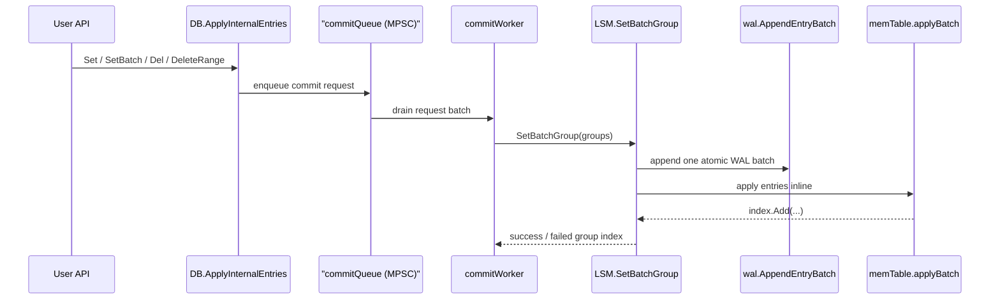
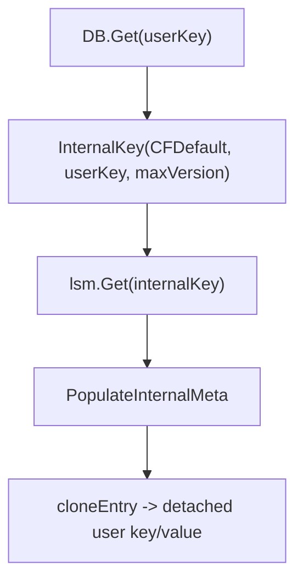
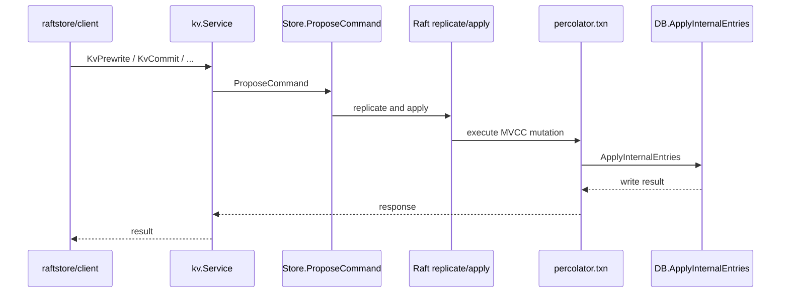

# Runtime Call Chains

This page documents the current runtime paths. Metadata values are stored inline
in WAL, memtable, and SST records.

---

## 1. Embedded Write Path

`Set`, `SetBatch`, `SetWithTTL`, `Del`, and `DeleteRange` share one path:

1. The public API allocates a non-transactional version and builds internal-key
   entries with `kv.NewInternalEntry`.
2. `ApplyInternalEntries` validates each key via `kv.SplitInternalKey`.
3. `batchSet` enqueues a commit request into the bounded MPSC commit queue.
4. The commit worker drains a request batch and calls `applyRequests`.
5. `applyRequests` writes one WAL entry-batch record and applies the same batch
   to the active memtable.
6. If `SyncWrites` is enabled, the request is handed to the sync pipeline or
   synchronously fsynced, depending on `SyncPipeline`.

Invariant: WAL append failure means the memtable is not touched. WAL success
followed by memtable apply failure is treated as unrecoverable and panics.

---

## 2. Embedded Read Path

1. `DB.Get` builds `InternalKey(CFDefault, userKey, nonTxnMaxVersion)`.
2. `loadBorrowedEntry` asks `lsm.Get` for the newest visible internal record.
3. `PopulateInternalMeta` aligns the decoded entry metadata with its internal
   key.
4. `DB.Get` returns a detached public entry with copied user key/value bytes.
5. `DB.GetInternalEntry` returns a borrowed internal entry; the caller must
   call `DecrRef`.

---

## 3. Iterators

`DB.NewIterator` builds a merged internal iterator from LSM iterators and
materializes public entries on demand:

1. Convert user seek key to internal seek key.
2. Split internal keys with `kv.SplitInternalKey`.
3. Apply user-key bounds and delete/expiry filtering.
4. Expose user-key entries.

`DB.NewInternalIterator` bypasses user-key rewrite and returns internal records
directly.

---

## 4. Distributed Write Path

Raftstore and Percolator ultimately reuse the same embedded write path:

1. `raftstore/client` issues `Mutate` / `TwoPhaseCommit` by region.
2. `kv.Service` routes the command through `Store.ProposeCommand`.
3. Raft replication commits the command.
4. The apply path calls `percolator.Prewrite`, `Commit`, rollback, or resolve.
5. Percolator builds MVCC entries with `kv.NewInternalEntry`.
6. `DB.ApplyInternalEntries` persists them through the commit queue, WAL, and
   memtable.

---

## 5. Entry Ownership

| Source | Returned entry type | Key form | Caller action |
| --- | --- | --- | --- |
| `DB.GetInternalEntry` | Borrowed pooled | Internal key | Must call `DecrRef()` once |
| `DB.Get` | Detached copy | User key | Must not call `DecrRef()` |
| `percolator.applyVersionedOps` temporary entries | Borrowed pooled | Internal key | Always `DecrRef()` after `ApplyInternalEntries` |
| `LSM.Get` / memtable reads | Borrowed pooled | Internal key | Upstream owner must release |

---

## 6. Key/Value Shape

| Stage | `Entry.Key` | `Entry.Value` | Notes |
| --- | --- | --- | --- |
| User write before queue | Internal key (`CF + user key + ts`) | Raw user bytes | Built by `NewInternalEntry` |
| WAL/memtable/SST stored form | Internal key | Encoded inline value payload | Used by replay, flush, compaction |
| `GetInternalEntry` output | Internal key | Raw inline value bytes | Internal caller view |
| `Get` / public iterator output | User key | Raw inline value bytes | External caller view |
