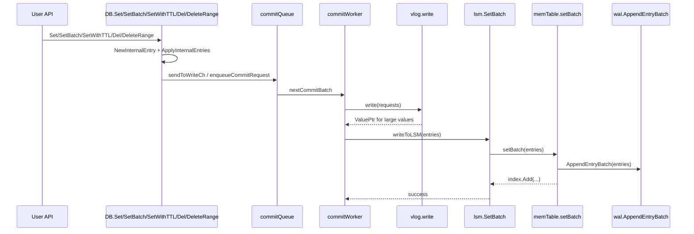
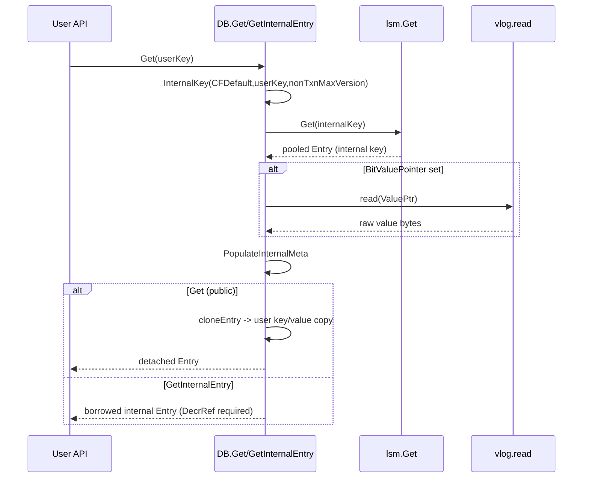
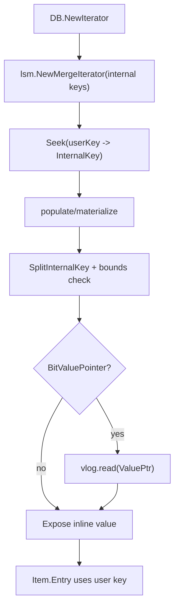
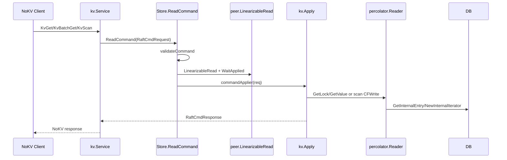
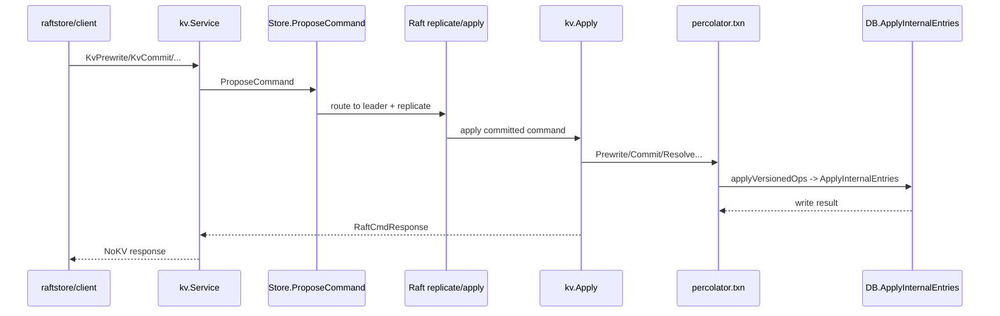

# Runtime Call Chains (Current)

This document focuses on the current execution paths in NoKV and maps API calls
to concrete functions in the codebase.

It intentionally describes only what is running today.

---

## 1. API Surface Snapshot

| Mode | Read APIs | Write APIs | Txn APIs |
| --- | --- | --- | --- |
| Embedded (`NoKV.DB`) | `Get`, `NewIterator`, `NewInternalIterator` | `Set`, `SetBatch`, `SetWithTTL`, `Del`, `DeleteRange`, `ApplyInternalEntries` | N/A (no standalone local txn API) |
| Distributed (`raftstore/kv`) | `KvGet`, `KvBatchGet`, `KvScan` | N/A direct write | `KvPrewrite`, `KvCommit`, `KvBatchRollback`, `KvResolveLock`, `KvCheckTxnStatus` |

Core entry points:

- Embedded DB: [`db.go`](../db.go), [`db_write.go`](../db_write.go), [`iterator.go`](../iterator.go)
- Distributed RPC: [`raftstore/kv/service.go`](../raftstore/kv/service.go)
- Raft read/propose bridge: [`raftstore/store/command_service.go`](../raftstore/store/command_service.go)
- MVCC logic: [`percolator/txn.go`](../percolator/txn.go), [`percolator/reader.go`](../percolator/reader.go)

---

## 2. Embedded Write Path (`Set` / `SetBatch` / `SetWithTTL` / `Del` / `DeleteRange`)

### 2.1 Function-Level Chain

1. `DB.Set` / `DB.SetBatch` / `DB.SetWithTTL` / `DB.Del` / `DB.DeleteRange` allocates monotonic non-transactional versions and creates internal-key entries via `kv.NewInternalEntry`.
2. `DB.ApplyInternalEntries` validates each internal key via `kv.SplitInternalKey`, then calls `batchSet`.
3. `batchSet` enqueues request (`sendToWriteCh` -> commit queue).
4. `commitWorker` drains a batch:
   - `vlog.write(requests)` writes large values first and produces `ValuePtr`.
   - `applyRequests` -> `writeToLSM` -> `lsm.SetBatch`.
5. `lsm.SetBatch` writes one atomic batch:
   - `memTable.setBatch`
   - `wal.AppendEntryBatch`
   - mem index insert.

### 2.2 Sequence Diagram

---

## 3. Embedded Read Path (`Get` / `GetInternalEntry`)

### 3.1 Function-Level Chain

1. `DB.Get` builds `InternalKey(CFDefault, userKey, nonTxnMaxVersion)`.
2. `loadBorrowedEntry` calls `lsm.Get` for the newest visible internal record.
3. If value is pointer (`BitValuePointer`), read real bytes via `vlog.read`, clear pointer bit.
4. `PopulateInternalMeta` ensures `CF/Version` cache matches internal key.
5. `DB.Get` returns detached public entry via `cloneEntry` (user key + copied value).
6. `DB.GetInternalEntry` returns borrowed internal entry (caller must `DecrRef`).

### 3.2 Sequence Diagram

---

## 4. Iterator Paths

### 4.1 Public Iterator (`DB.NewIterator`)

1. Build merged internal iterator: `lsm.NewIterators` + `lsm.NewMergeIterator`.
2. `Seek` converts user key to internal seek key (`CFDefault + nonTxnMaxVersion`).
3. `populate/materialize`:
   - parse internal key (`kv.SplitInternalKey`)
   - apply bounds on user key
   - optionally resolve vlog pointer
   - expose user-key item.

### 4.2 Internal Iterator (`DB.NewInternalIterator`)

- Directly returns merged iterator over internal keys.
- No user-key rewrite; caller handles `kv.SplitInternalKey`.

---

## 5. Distributed Read Path (`KvGet` / `KvBatchGet` / `KvScan`)

### 5.1 Function-Level Chain

1. `raftstore/kv.Service` builds `RaftCmdRequest` from NoKV RPC.
2. `Store.ReadCommand`:
   - `validateCommand` (region/epoch/leader/key-range)
   - `peer.LinearizableRead`
   - `peer.WaitApplied`
   - `commandApplier(req)` (injected as `kv.Apply`).
3. `kv.Apply` executes:
   - `handleGet` -> `percolator.Reader.GetLock` + `GetValue`
   - `handleScan` -> iterate `CFWrite`, resolve visible versions.

### 5.2 Sequence Diagram

---

## 6. Distributed Write Path (2PC via Raft Apply)

### 6.1 Function-Level Chain

1. Client (`raftstore/client`) runs `Mutate` / `TwoPhaseCommit` by region.
2. RPC layer (`kv.Service`) sends write commands through `Store.ProposeCommand`.
3. Raft replication commits log entries; apply path invokes `kv.Apply`.
4. `kv.Apply` dispatches to `percolator.Prewrite/Commit/BatchRollback/ResolveLock/CheckTxnStatus`.
5. Percolator mutators call `applyVersionedOps`:
   - build entries via `kv.NewInternalEntry`
   - call `db.ApplyInternalEntries`
   - release refs (`DecrRef`).
6. Storage then follows the same embedded write pipeline (vlog -> LSM/WAL).

### 6.2 Sequence Diagram

---

## 7. Entry Ownership and Refcount Rules

| Source | Returned entry type | Key form | Caller action |
| --- | --- | --- | --- |
| `DB.GetInternalEntry` | Borrowed pooled | Internal key | Must call `DecrRef()` once |
| `DB.Get` | Detached copy | User key | Must not call `DecrRef()` |
| `percolator.applyVersionedOps` temporary entries | Borrowed pooled | Internal key | Always `DecrRef()` after `ApplyInternalEntries` |
| `LSM.Get` / memtable reads | Borrowed pooled | Internal key | Upstream owner must release |

---

## 8. Key/Value Shape by Stage

| Stage | `Entry.Key` | `Entry.Value` | Notes |
| --- | --- | --- | --- |
| User write before queue | Internal key (`CF + user key + ts`) | Raw user bytes | Built by `NewInternalEntry` |
| After vlog step | Internal key | Inline value or `ValuePtr.Encode()` | Pointer marked by `BitValuePointer` |
| LSM/WAL stored form | Internal key | Encoded value payload | Used by replay/flush/compaction |
| `GetInternalEntry` output | Internal key | Raw value bytes (pointer resolved) | Internal caller view |
| `Get` / public iterator output | User key | Raw value bytes | External caller view |
