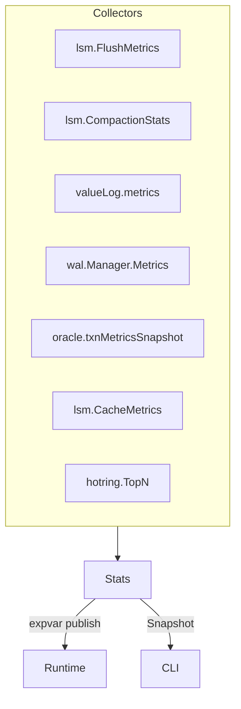

# Stats & Observability Pipeline

NoKV exposes internal health via the Go `expvar` package and the `nokv stats` CLI. The statistics subsystem is implemented in [`stats.go`](../stats.go) and runs continuously once the DB is open.

---

## 1. Architecture



* `newStats` wires together reusable `expvar.Int/Float` gauges (avoiding duplicates if the process restarts an embedded DB).
* `Stats.StartStats` launches a goroutine that ticks every 5s (configurable via `Stats.interval`) to refresh values.
* `Stats.Snapshot` can be called on-demand (e.g. CLI) without mutating expvar state.

---

## 2. Snapshot Fields

| Field | Source | Description |
| --- | --- | --- |
| `Entries` | `lsm.EntryCount()` | Total MVCC entries (L0-Ln + memtables). Mirrors `Stats.EntryNum` for backwards compat. |
| `FlushPending/Queue/Active` | `lsm.FlushMetrics()` | Pending immutables, queue length, workers currently building SSTs. |
| `FlushWait/Build/ReleaseMs` | Derived from `WaitNs/BuildNs/ReleaseNs` averages | End-to-end latency of flush pipeline stages. |
| `CompactionBacklog/MaxScore` | `lsm.CompactionStats()` | How many level files await compaction and the hottest score. |
| `ValueLogSegments/PendingDel/DiscardQueue/Head` | `valueLog.metrics()` | Tracks vlog utilisation and GC backlog. |
| `WALActiveSegment/SegmentCount/Removed/ActiveSize` | `wal.Manager.Metrics()` | Observes WAL rotation cadence and current segment byte usage (pairs with raft lag metrics). |
| `WALTypedRecordRatio/Warning/Reason` | WAL backlog watchdog (`Stats.Snapshot`) | Tracks ratio of raft typed records in the WAL and surfaces warnings with reasons when exceeding thresholds. |
| `WALAutoGCRuns/Removed/LastUnix` | WAL backlog watchdog | Automated WAL GC passes, total segments removed, and the Unix timestamp of the last run. |
| `WriteQueueDepth/Entries/Bytes` | `writeMetrics.snapshot()` | Size of the asynchronous write queue. |
| `WriteAvg*` | `writeMetrics` averages | Request wait times, vlog latency, apply latency. |
| `WriteBatchesTotal` | `writeMetrics` | Lifetime batches processed. |
| `HotWriteLimited` | `db.hotWriteLimited` | Number of write attempts rejected by `Options.WriteHotKeyLimit` (HotRing write throttling). |
| `WriteThrottleActive` | `db.blockWrites` | Indicates when writes are being throttled. |
| `TxnsActive/Started/Committed/Conflicts` | `oracle.txnMetricsSnapshot()` | MVCC activity counters. |
| `HotKeys` | `hotring.TopN()` | Top-K hot key counts. |
| `HotWriteKeys` | `hotring.TopN()` | Top-K hot write key counts (write-only ring). |
| `HotWriteRing` | `hotring.Stats()` | Write-only HotRing counters snapshot. |
| `BlockL0/L1/BloomHitRate` | `lsm.CacheMetrics()` | Block and bloom cache hit ratios. |
| `IndexHitRate` | `lsm.CacheMetrics()` | SST 索引块缓存命中率。 |
| `IteratorReused` | `iteratorPool.reused()` | Frequency of iterator pooling hits. |
| `RaftGroupCount/LaggingGroups/MaxLagSegments/LagWarnThreshold/RaftLagWarning` | `manifest.RaftPointerSnapshot()` | Tracks follower backlogs; `LagWarnThreshold` comes from `Options.RaftLagWarnSegments`, and `RaftLagWarning` toggles when any group exceeds it. |
| `RegionTotal/New/Running/Removing/Tombstone/Other` | `store.RegionMetrics` | Multi-Raft region state distribution. CLI attaches the first available `RegionMetrics` by default; pass `--no-region-metrics` to disable. |

All values are exported under the `NoKV.*` namespace via expvar (see `newStats`).

---

## 3. CLI & JSON Output

* `nokv stats --workdir <dir>` prints a human-readable table (queue lengths, throughput, hot keys, region totals). It automatically attaches `RegionMetrics` when available; add `--no-region-metrics` to produce a manifest-only snapshot.
* When `RaftLagWarning=true` the CLI emits an extra `Raft.Warning` line; it also surfaces `Regions.Total (...)` so operators can quickly gauge Region lifecycle health.
* `nokv stats --json` emits the raw snapshot for automation. Example snippet:

```json
{
  "entries": 1048576,
  "flush_queue_length": 2,
  "vlog_head": {"fid": 5, "offset": 184320},
  "hot_keys": [{"key": "user:123", "count": 42}]
}
```

The CLI internally instantiates a read-only DB handle, calls `Stats.Snapshot`, and formats the response—no background goroutine is needed.

---

## 4. Integration with Other Modules

| Module | Contribution |
| --- | --- |
| WAL | `wal.Manager.Metrics()` counts active/removable segments, aiding post-recovery validation. |
| Value Log | `valueLog.metrics()` exposes GC backlog, enabling alerting when discard queues stall. |
| HotRing | Publishes hot key JSON via expvar so dashboards can visualise top offenders. |
| Transactions | Oracle counters help gauge contention (high conflicts → tune workload). |
| Cache | Hit rates clarify whether cache sizing (hot/cold tier) needs adjustment. |

---

## 5. Comparisons

| Engine | Observability |
| --- | --- |
| RocksDB | `iostats`, `perf_context`, `ldb` commands. Requires manual parsing. |
| Badger | Prometheus metrics (optional). |
| NoKV | Built-in expvar gauges + CLI + recovery trace toggles. |

NoKV emphasises zero-dependency observability. Everything is consumable via HTTP `/debug/vars` or the CLI, making it easy to integrate with Go services.

---

## 6. Operational Guidance

* Watch `FlushQueueLength` and `CompactionBacklog` together—if both grow, increase flush workers or adjust level sizes.
* `ValueLogDiscardQueue > 0` for extended periods indicates GC is blocked; inspect `NoKV.ValueLog.GcRuns` and consider tuning thresholds.
* `WriteThrottleActive` toggling frequently suggests L0 is overwhelmed; cross-check `BlockL0HitRate` and compaction metrics.
* `HotWriteLimited` climbing steadily means HotRing write throttling is firing—surface `utils.ErrHotKeyWriteThrottle` to clients and investigate abusive keys via the `HotKeys` list.
* `RaftLagWarning` toggling to `true` means at least one follower lags the leader by more than `Options.RaftLagWarnSegments`; inspect `Raft.Warning` from the CLI and consider snapshot resend or throttling the offending node.
* `Regions.Total` should match the expected cluster topology; sustained `Removing/Tombstone` counts indicate stalled cleanup—investigate split/merge logic or stuck replicas.

Refer to [`docs/testing.md`](testing.md#4-observability-in-tests) for scripted checks that validate stats during CI runs.
