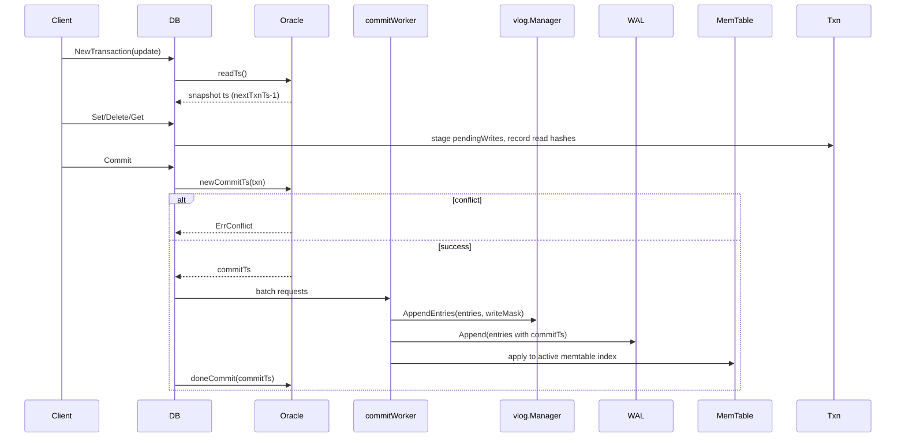

# Transaction & MVCC Design

NoKV provides snapshot-isolated transactions backed by a lightweight **oracle** that hands out timestamps, tracks conflicts, and coordinates with the write pipeline. The implementation lives entirely in [`txn.go`](../txn.go) with metrics surfaced via [`stats.go`](../stats.go).

---

## 1. Components at a Glance

| Component | Purpose | Key Functions |
| --- | --- | --- |
| `oracle` | Issues read/commit timestamps, performs conflict checks, persists watermark progress. | [`readTs`](../txn.go#L80-L100), [`newCommitTs`](../txn.go#L142-L190), [`doneCommit`](../txn.go#L206-L208) |
| `Txn` | User-facing transaction state: pending writes, read-set fingerprints, MVCC metadata. | [`SetEntry`](../txn.go#L412-L425), [`Get`](../txn.go#L428-L502), [`Commit`](../txn.go#L618-L671) |
| `pendingWritesIterator` | Allows iterator merge to see unflushed txn writes. | [`newPendingWritesIterator`](../txn.go#L324-L347) |
| Metrics | Tracks counts of started/committed/conflicted txns. | [`trackTxnStart`](../txn.go#L58-L66), [`txnMetricsSnapshot`](../txn.go#L72-L78) |

The oracle is initialised during `DB.Open`, sharing lineage with BadgerDB's MVCC model. Unlike RocksDB—which relies on WriteBatch/TwoPhaseCommit extensions—transactions are first-class citizens, and the core engine enforces ordering.

---

## 2. Timestamp & Conflict Flow



1. **Start** – `DB.newTransaction` calls [`oracle.readTs`](../txn.go#L80-L100), which waits for all prior commits to finish (`txnMark.WaitForMark`) so new readers see a consistent snapshot. In distributed deployments, clients must obtain the `startVersion` themselves (see [Timestamp sources](#timestamp-sources)).
2. **Reads** – `Txn.Get` first checks `pendingWrites`; otherwise it merges LSM iterators and value-log pointers under the read timestamp. For update transactions the read key fingerprint is recorded in `Txn.reads` via [`addReadKey`](../txn.go#L511-L526).
3. **Conflict detection** – When `Options.DetectConflicts` is enabled, `oracle.newCommitTs` iterates `oracle.committedTxns` and compares read fingerprints against keys written by newer commits. This mirrors Badger's optimistic strategy.
4. **Commit timestamp** – `newCommitTs` increments `nextTxnTs`, registers the commit in `txnMark`, and stores the conflict key set for future comparisons.
5. **Apply** – `Txn.commitAndSend` assigns the commit timestamp to each pending entry (`kv.KeyWithTs`), enqueues them through `sendToWriteCh`, and returns a callback that waits for the batch completion. Only after the callback runs does the oracle's `doneCommit` release the commit watermark.
6. **Value log ordering** – As with non-transactional writes, the commit worker runs `valueLog.write` (which calls `Manager.AppendEntries`) before the WAL append. On failure `vlog.manager.Rewind` ensures partial writes do not leak.

RocksDB's default WriteBatch lacks conflict detection, relying on application-level locking; NoKV ships with snapshot isolation and optional detection, similar to Badger's `Txn` but with integrated metrics and iterator pooling.

---

## 3. Data Structures

### Oracle Watermarks

```text
oracle{
  nextTxnTs       // next commit timestamp to assign
  txnMark         // watermark waiting for WAL/vlog durability
  readMark        // tracks oldest active read timestamp
  committedTxns[] // sliding window of conflict key sets
}
```

* `txnMark` / `readMark` are `utils.WaterMark` instances. They guarantee all writes with timestamp ≤ `readTs` are durable before a new read snapshot begins, mirroring Badger's approach to avoid reading half-committed data.
* `cleanupCommittedTransactions` prunes conflict history based on the oldest outstanding read, preventing unbounded memory use.

### Txn State

```go
type Txn struct {
    readTs   uint64
    commitTs uint64
    pendingWrites map[string]*kv.Entry
    conflictKeys  map[uint64]struct{}
    reads         []uint64
    numIterators  int32
    discarded     bool
    update        bool
}
```

* Pending writes retain the caller's entry pointers until commit; NoKV copies values only when moving them into the write batch.
* Read fingerprints use `kv.MemHash`, so conflict detection is order-independent and compact.
* MVCC versions are encoded in the key suffix (`KeyWithTs`), matching the LSM's descending version order.

### Iterator Integration

* `Txn.newPendingWritesIterator` materialises staged entries as a sorted slice, allowing transaction iterators to merge them with memtables/SST tables. This ensures `Txn.NewIterator` sees writes immediately without affecting other snapshots.
* `Txn.numIterators` enforces that all iterators close before commit/discard—helpful for catching resource leaks in tests (`txn_iterator_test.go`).

---

## 4. Commit & Error Handling

| Stage | Failure Handling |
| --- | --- |
| Conflict | `oracle.newCommitTs` returns `(0, true)`; `Txn.Commit` surfaces `utils.ErrConflict` and leaves state untouched. |
| Value log append | `valueLog.write` rewinds via `Manager.Rewind`; `req.Wait` returns the error so callers can retry safely. |
| WAL append | `sendToWriteCh` propagates WAL errors; commit watermark is cleared immediately in that case. |
| Callback mode | `Txn.CommitWith` schedules `runTxnCallback` on a goroutine; user callbacks always execute (success or error). |

The final call to `Txn.Discard` runs regardless of success, marking the read watermark done and decrementing the oracle's active counter.

---

## 5. Comparisons

| Feature | RocksDB | BadgerDB | NoKV |
| --- | --- | --- | --- |
| Isolation | Optional (WritePrepared/2PC) | Snapshot isolation | Snapshot isolation with `WaterMark` barriers |
| Conflict detection | External | Optional optimistic | Optional optimistic keyed by `utils.MemHash` |
| Iterator view | Snapshot handles, manual merging | Built-in | Built-in with pending write iterator |
| Metrics | `rocksdb.transactions.*` when enabled | Basic stats | `NoKV.Txns.*` expvar counters + CLI |

NoKV inherits Badger's optimistic concurrency but strengthens durability ordering by coupling commits with the same write pipeline that non-transactional writes use. Compared with RocksDB's transactional library, the Go implementation remains lightweight and requires no external locks.

---

## 6. Operational Notes

* **Long-running reads**: watch `NoKV.Txns.Active` and `oracle.readMark.DoneUntil()`—slow consumers keep old versions alive, delaying vlog GC and compaction reclamation.
* **Non-transactional APIs**: `DB.Set/Get/Del` and `SetCF/GetCF/DelCF` use a MaxUint64 sentinel version for "latest". Do not mix these writes with MVCC/Txn writes in the same database.
* **Managed mode**: exposing `Txn.SetEntry` with pre-set versions allows replication/replay flows. Because commit timestamps may diverge, transaction markers are only set when all entries share a single commitTs.
* **Throttling**: combine `HotRing.TouchAndClamp` with per-transaction analytics to detect hot-key write storms that lead to frequent conflicts.

See [`docs/testing.md`](testing.md#transactions) for the regression matrix covering conflict detection, iterator semantics, and managed timestamps.

---

## 7. Timestamp Sources

Replica nodes do **not** generate timestamps during TinyKV RPC handling; the values sent in `KvPrewrite`/`KvCommit` are applied verbatim. For teaching and prototyping you can pick from two approaches:

- **Single-client experiments** – choose monotonically increasing integers in your client code (as shown in `raftstore/client/client_test.go`).
- **Shared allocator** – run the sample TSO service under `scripts/tso` to hand out globally increasing timestamps:

  ```bash
  go run ./scripts/tso --addr 127.0.0.1:9494 --start 100

  # request one timestamp
  curl -s http://127.0.0.1:9494/tso
  # request a batch of 16
  curl -s "http://127.0.0.1:9494/tso?batch=16"
  ```

  Each call returns JSON (`{"timestamp":123,"count":1}`), where `timestamp` is the first value in the allocated range. Clients can use the first value for `startVersion`, or the entire range to provision multiple transactions. This keeps the learning focus on the Percolator flow while demonstrating how production systems would obtain globally ordered timestamps.
