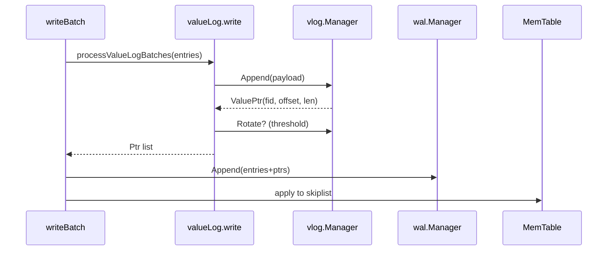
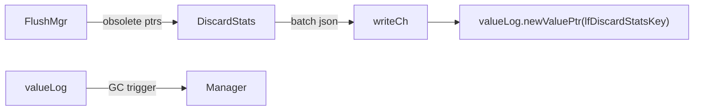

# Value Log (vlog) Design

NoKV keeps the LSM tree lean by separating large values into sequential **value log** (vlog) files. The module is split between

- [`vlog/manager.go`](../vlog/manager.go) – owns the open file set, append/rotate/read primitives, and crash recovery helpers.
- [`vlog.go`](../vlog.go) – integrates the manager with the DB write path, discard statistics, and garbage collection (GC).

The design echoes BadgerDB's value log while remaining manifest-driven like RocksDB's `blob_db`: vlog metadata (head pointer, pending deletions) is persisted inside the manifest so recovery can reconstruct the exact state without scanning the filesystem.

---

## 1. Directory Layout & Naming

```text
<workdir>/
  vlog/
    00000.vlog
    00001.vlog
    ...
```

* Files are named `%05d.vlog` and live under `workdir/vlog/`. [`Manager.populate`](../vlog/manager.go#L53-L92) discovers existing segments at open.
* `Manager` tracks the active file ID (`activeID`) and byte offset; [`Manager.Head`](../vlog/manager.go#L298-L307) exposes these so the manifest can checkpoint them (`manifest.EditValueLogHead`).
* Files created after a crash but never linked in the manifest are removed during [`valueLog.reconcileManifest`](../vlog.go#L76-L125).

---

## 2. Record Format

The vlog uses the shared encoding helper (`kv.EncodeEntryTo`), so entries written to the value log and the WAL are byte-identical.

```
+--------+----------+------+-------------+-----------+-------+
| KeyLen | ValueLen | Meta | ExpiresAt   | Key bytes | Value |
+--------+----------+------+-------------+-----------+-------+
                                             + CRC32 (4 B)
```

* Header fields are varint-encoded (`kv.EntryHeader`).
* The first 20 bytes of every segment are reserved (`kv.ValueLogHeaderSize`) for future metadata; iteration always skips this fixed header.
* `file.LogFile.EncodeEntry`/`DecodeEntry` perform the layout work, and each append finishes with a CRC32 to detect torn writes.
* `vlog.VerifyDir` scans all segments with [`sanitizeValueLog`](../vlog/manager.go#L348-L418) to trim corrupted tails after crashes, mirroring RocksDB's `blob_file::Sanitize`. Badger performs a similar truncation pass at startup.

---

## 3. Manager API Surface

```go
mgr, _ := vlog.Open(vlog.Config{Dir: "...", MaxSize: 1<<29})
ptr, _ := mgr.Append(payload)
_ = mgr.Rotate()        // when ptr.Offset+ptr.Len exceeds MaxSize
val, unlock, _ := mgr.Read(ptr)
unlock()                // release read lock
_ = mgr.Rewind(*ptr)    // rollback partially written batch
_ = mgr.Remove(fid)     // close + delete file
```

Key behaviours:

1. **Append + Rotate** – [`Manager.Append`](../vlog/manager.go#L108-L160) writes into the active file and bumps the in-memory offset. Rotation calls [`Manager.Rotate`](../vlog/manager.go#L162-L198), syncing the old file via `file.LogFile.DoneWriting` before creating the next `%05d.vlog`.
2. **Crash recovery** – [`Manager.Rewind`](../vlog/manager.go#L437-L520) truncates the active file and removes newer files when a write batch fails mid-flight. `valueLog.write` uses this to guarantee idempotent WAL/value log ordering.
3. **Safe reads** – [`Manager.Read`](../vlog/manager.go#L200-L226) grabs a per-file `RWMutex`, copies the bytes into a new slice, and hands back an unlock function so callers release the file lock quickly.
4. **Verification** – [`VerifyDir`](../vlog/manager.go#L308-L411) validates entire directories (used by CLI and recovery) by parsing headers and CRCs.

Compared with RocksDB's blob manager the surface is intentionally small—NoKV treats the manager as an append-only log with rewind semantics, while RocksDB maintains index structures inside the blob file metadata.

---

## 4. Integration with DB Writes



1. [`valueLog.write`](../vlog.go#L240-L272) iterates through batched entries. For entries staying in LSM (`shouldWriteValueToLSM`), it records a zero `ValuePtr`. Others stream their bytes via `kv.EncodeEntryTo` straight into the vlog.
2. If the append would exceed `Options.ValueLogFileSize`, the manager rotates before continuing. The WAL append happens **after** the value log append so that crash replay observes consistent pointers.
3. Any error triggers `Manager.Rewind` back to the saved head pointer, removing new files and truncating partial bytes. [`vlog_test.go`](../vlog_test.go#L139-L209) exercises both append- and rotate-failure paths.
4. `Txn.Commit` piggybacks on the same pipeline: pending writes are turned into entries and routed through `processValueLogBatches` before the WAL write, ensuring MVCC correctness.

Badger follows the same ordering (value log first, then write batch). RocksDB's blob DB instead embeds blob references into the WAL entry before the blob file write, relying on two-phase commit between WAL and blob; NoKV avoids the extra coordination by reusing a single batching loop.

---

## 5. Discard Statistics & GC



* `lfDiscardStats` aggregates per-file discard counts from `lsm.FlushTable` completion (`valueLog.lfDiscardStats.push` inside `lsm/flush`). Once the in-memory counter crosses [`discardStatsFlushThreshold`](../vlog.go#L27), it marshals the map into JSON and writes it back through the DB pipeline under the special key `!NoKV!discard`.
* `valueLog.flushDiscardStats` consumes those stats, ensuring they are persisted even across crashes. During recovery `valueLog.populateDiscardStats` replays the JSON payload to repopulate the in-memory map.
* GC uses `discardRatio = discardedBytes/totalBytes` derived from [`Manager.Sample`](../vlog/manager.go#L336-L401), which applies windowed iteration based on configurable ratios. If a file exceeds the configured threshold, [`valueLog.doRunGC`](../vlog.go#L316-L417) rewrites live entries into the current head (using `Manager.Append`) and then [`valueLog.rewrite`](../vlog.go#L418-L531) schedules deletion edits in the manifest.
  * Sampling behaviour is controlled by `Options.ValueLogGCSampleSizeRatio` (default 0.10 of the file) and `Options.ValueLogGCSampleCountRatio` (default 1% of the configured entry limit). Setting either to `<=0` keeps the default heuristics. `Options.ValueLogGCSampleFromHead` starts sampling from the beginning instead of a random window.
* Completed deletions are logged via `lsm.LogValueLogDelete` so the manifest can skip them during replay. When GC rotates to a new head, `valueLog.updateHead` records the pointer and bumps the `NoKV.ValueLog.HeadUpdates` counter.

RocksDB's blob GC leans on compaction iterators to discover obsolete blobs. NoKV, like Badger, leverages flush/compaction discard stats so GC does not need to rescan SSTs.

---

## 6. Recovery Semantics

1. `DB.Open` restores the manifest and fetches the last persisted head pointer.
2. [`valueLog.open`](../vlog.go#L175-L224) launches `flushDiscardStats` and iterates every vlog file via [`valueLog.replayLog`](../vlog.go#L706-L866). Files marked invalid in the manifest are removed; valid ones are registered in the manager's file map.
3. `valueLog.replayLog` streams entries, invoking the provided `replayFn` (usually WAL re-application) for any value that should be materialised into the memtable.
4. `Manager.VerifyDir` trims torn records so replay never sees corrupt payloads.
5. After replay, `valueLog.populateDiscardStats` rehydrates discard counters from the persisted JSON entry if present.

The flow matches Badger's recovery (scan vlog → replay WAL) but adds manifest-backed head checks, similar to RocksDB's reliance on `MANIFEST` to mark blob files live or obsolete.

---

## 7. Observability & CLI

* Metrics in [`stats.go`](../stats.go#L12-L126) report segment counts, pending deletions, discard queue depth, and GC head pointer via `expvar`.
* `nokv vlog --workdir <dir>` loads a manager in read-only mode and prints current head plus file status (valid, gc candidate). It invokes [`vlog.VerifyDir`](../vlog/manager.go#L308-L411) before describing segments.
* Recovery traces controlled by `RECOVERY_TRACE_METRICS` log every head movement and file removal, aiding pressure testing of GC edge cases. For ad-hoc diagnostics, enable `Options.ValueLogVerbose` to emit replay/GC messages to stdout.

---

## 8. Quick Comparison

| Capability | RocksDB BlobDB | BadgerDB | NoKV |
| --- | --- | --- | --- |
| Head tracking | In MANIFEST (blob log number + offset) | Internal to vlog directory | Manifest entry via `EditValueLogHead` |
| GC trigger | Compaction sampling, blob garbage score | Discard stats from LSM tables | Discard stats flushed through `lfDiscardStats` |
| Failure recovery | Blob DB and WAL coordinate two-phase commits | Replays value log then LSM | Rewind-on-error + manifest-backed deletes |
| Read path | Separate blob cache | Direct read + checksum | `Manager.Read` with copy + per-file lock |

By anchoring the vlog state in the manifest and exposing rewind/verify primitives, NoKV maintains the determinism of RocksDB while keeping Badger's simple sequential layout.

---

## 9. Further Reading

* [`docs/recovery.md`](recovery.md#value-log-recovery) – failure matrix covering append crashes, GC interruptions, and manifest rewrites.
* [`docs/cache.md`](cache.md#value-pointer-reads) – how vlog-backed entries interact with the block cache.
* [`docs/stats.md`](stats.md#value-log-metrics) – metric names surfaced for monitoring.
