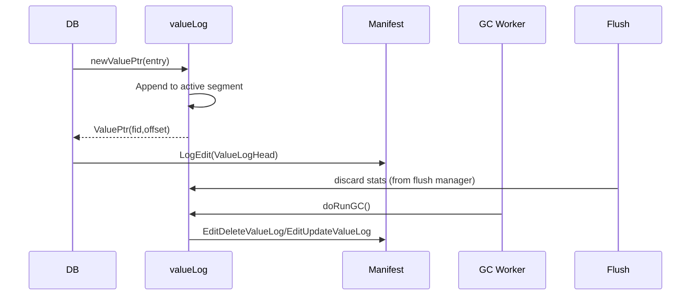

# ValueLog Subsystem

NoKV separates large values into sequential value-log (vlog) segments to keep SSTables compact. The architecture blends RocksDB's blob file concepts with Badger's dedicated vlog manager, while remaining fully integrated with manifest metadata and flush discard statistics.

---

## 1. Directory Layout

```text
WorkDir/
  vlog/
    000001.vlog
    000002.vlog
  vlog/CURRENT.head (optional checkpoint written by manifest)
```

- Vlog segments live under `workdir/vlog/` and follow `%06d.vlog` naming (see `vlog/manager.go`).
- `valueLog` (in [`vlog.go`](../vlog.go)) orchestrates append, read, rotation, and GC using `vlog.Manager`.
- The head pointer (fid + offset) is recorded in the manifest so recovery knows where to resume appends.

---

## 2. Record Format

```text
| Header | Key | Value | CRC |
Header = Meta + KeyLen + ValueLen + ExpiresAt (varint encoded)
```

Payload encoding mirrors WAL entries (shared helpers in `utils`). The CRC allows truncated or corrupted records to be detected during replay; invalid tails are truncated, mimicking Badger's recovery behaviour.

---

## 3. Core Types & API

```go
type valueLog struct {
    filesMap map[uint32]*logFile
    lfDiscardStats discardStats
    writableLog   *logFile
    lock          sync.RWMutex
}

type Manager interface {
    Open(cfg Config) (*Manager, error)
    Append(data []byte) (fid uint32, offset uint64, err error)
    Read(fid uint32, offset uint64) ([]byte, error)
    Rotate() error
    Remove(fid uint32) error
    Head() ValuePtr
}
```

- `valueLog.newValuePtr` writes entries to the active segment and returns `utils.ValuePtr` (fid, offset, length, version, meta).
- `valueLog.get` reads and decodes the payload using `Manager.OpenReadOnly` semantics.
- `valueLog.doRunGC` scans discard stats, rewrites live entries into new segments, and schedules obsolete segments for removal.

The manager keeps the file map and active writer locked under RWMutex so reads can proceed concurrently with appends, similar to Badger's concurrency model.

---

## 4. Lifecycle



- Writes – `processValueLogBatches` executes before WAL append; the returned `ValuePtr` is embedded into the WAL payload so replay can restore vlog metadata.
- GC – triggered by discard stats or manual CLI. Live records are copied to fresh segments; old files are closed, manifest receives delete edits, and files are removed.
- Recovery – `valueLog.replay` enumerates vlog files, builds `filesMap`, and reconciles with manifest metadata (dropping files marked invalid). The head pointer from manifest ensures appends continue from the right offset.

---

## 5. Integration with LSM & Transactions

- `lsm` flush completion calls `db.vlog.lfDiscardStats.push` to update discard ratios for keys being compacted out.
- `Txn.Get` fetches values through `valueLog.get` when encountering a `ValuePtr`, so snapshot isolation includes vlog-backed entries transparently.
- WAL replay reconstructs both memtables and vlog pointers, guaranteeing transactional atomicity (`Txn.Commit` writes both WAL + vlog before memtable mutation).

This mirrors Badger's pattern but adds manifest-backed checkpoints to avoid scanning directories after crashes.

---

## 6. Observability & CLI

- Metrics: `NoKV.ValueLog.GcRuns`, `SegmentsRemoved`, `HeadUpdates`, exposed via `Stats.collect`.
- CLI: `nokv vlog --workdir <dir> --json` prints active segment, head offset, and each segment's status (valid, gc_candidate, etc.).
- Recovery traces: enabling `RECOVERY_TRACE_METRICS` logs vlog head adjustments and GC progress.

---

## 7. GC Strategy

1. Flush manager emits discard stats (key ranges / counts).
2. `valueLog.pickLogfile` selects a segment exceeding the discard ratio threshold.
3. `rewrite` copies surviving entries into the current head segment, updating manifest via `EditUpdateValueLog`.
4. `removeFiles` deletes fully reclaimed segments and logs `EditDeleteValueLog` so recovery does not reopen them.

Compared with RocksDB: when using `blob_db`, RocksDB tracks blob files separately and requires a dedicated GC job. NoKV's vlog GC is lighter-weight and leverages flush metadata so it does not need to scan SSTables.

---

## 8. Failure Scenarios

- **Crash during append** – WAL still has the entry; on restart `valueLog.recover` trims partial records and WAL replay replays the value pointer.
- **Crash after GC delete edit but before file removal** – `db_recovery_test.go::TestRecoveryRemovesStaleValueLogSegment` ensures the file is removed on next open.
- **Manifest rewrite with vlog edits** – tests ensure vlog metadata persists across manifest compaction, mirroring RocksDB's blob metadata behaviour.

For the full recovery matrix, see [recovery.md](recovery.md).
